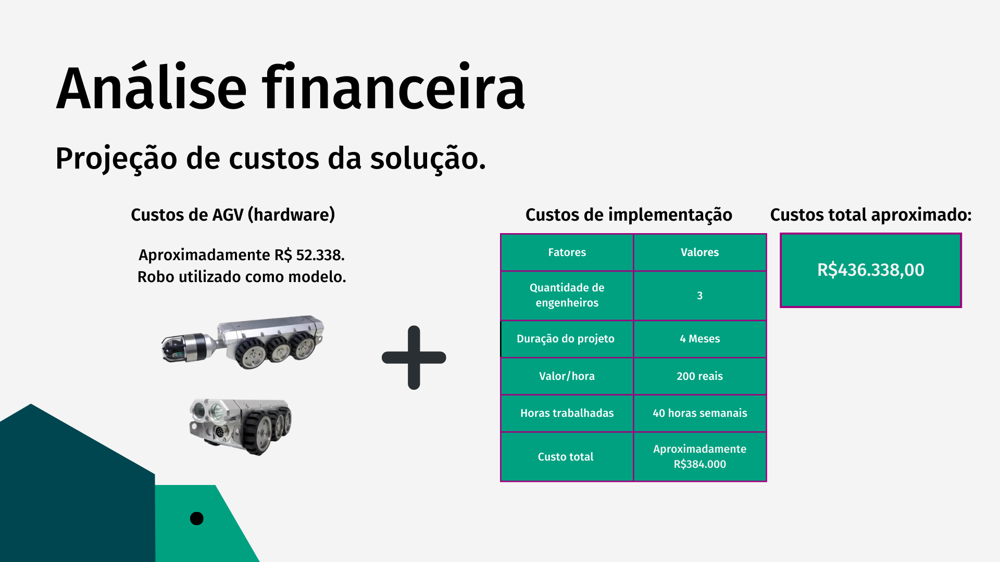

<table>
<tr>
<td>

</td>
<td>
</td>
</tr>
</table>

- [Entendimento de negócios](#entendimento-de-negócios)
  - [Matriz de oceano azul](#matriz-de-oceano-azul)
  - [Matriz de risco](#matriz-de-risco)
    - [Riscos](#riscos)
    - [Oportunidades](#oportunidades)
    - [Mitigação de riscos](#mitigação-de-riscos)
  - [Personas](#personas)
  - [Canvas de proposta de valor](#canvas-de-proposta-de-valor)
  - [User stories](#user-stories)
    - [Técnico](#técnico)
    - [Supervisora](#supervisora)
  - [Análise financeira](#análise-financeira)
- [Entendimento de metadesign](#entendimento-de-metadesign)
  - [Fatores mercadológicos](#fatores-mercadológicos)
    - [Orientação ao mercado e precificação](#orientação-ao-mercado-e-precificação)
    - [Cenário do mercado](#cenário-do-mercado)
    - [Visão do projeto proposto](#visão-do-projeto-proposto)
  - [Sistema produto-design](#sistema-produto-design)
    - [Missão do projeto](#missão-do-projeto)
    - [Unidade formal entre o design do produto, as formas de divulgação e venda](#unidade-formal-entre-o-design-do-produto-as-formas-de-divulgação-e-venda)
    - [Sustentabilidade ambiental](#sustentabilidade-ambiental)
    - [Proposta inovadora](#proposta-inovadora)
- [Arquitetura do sistema](#arquitetura-do-sistema)
  - [Requisitos funcionais e não funcionais](#requisitos-funcionais-e-não-funcionais)
    - [Funcionais](#funcionais)
    - [Não funcionais](#não-funcionais)
  - [Viabilidade técnica](#viabilidade-técnica)
  - [Proposta geral](#proposta-geral)
  - [Diagrama de blocos](#diagrama-de-blocos)
    - [Tabela de componentes](#tabela-de-componentes)
  - [Simulação e otimização de rota](#simulacao)
  - [Desenvolvimento de Software](#software)
- [Referências](#referências)

# Entendimento de negócios

## Matriz de oceano azul

Utilizamos a matriz oceano azul no projeto de AGV para que nossa equipe possa descobrir novas oportunidades de mercado e criar um produto único e de alta qualidade, diferente dos concorrentes. Também podemos entender o que o cliente precisa e adaptar o produto para atender às suas necessidades e expectativas.

Ao comparar o processo atualmente utilizado pela Gerdau com o novo processo proposto, é possível observar diversos ganhos significativos, especialmente em relação à automação. Através de entrevistas com o cliente e análise de material presente no Tapi, identificamos que a automação permitirá um grande avanço quando a segurança dos contribuíntes e análise dos espaços.

Com base na análise da matriz oceano azul, é possível observar que a implementação do robô resultará em uma redução significativa nos CUSTOS, uma vez que, após o investimento inicial, a manutenção do equipamento será de baixo custo, e não haverá mais o risco de incidentes trabalhistas nessa área, o que poderia acarretar em altos custos para a Gerdau. Além disso, a utilização do robô aumentará a SEGURANÇA, uma vez que não haverá mais pessoas operando em espaços confinados, o que diminuirá significativamente as chances de acidentes. Entretanto, é importante ressaltar que falhas humanas ainda podem ocorrer, mesmo após a inspeção robótica.

O principal objetivo do projeto é a AUTOMAÇÃO, que ainda não está presente no modelo atual. Com a implementação do robô, os DASHBOARDS poderão ser automatizados e fornecerão dados com alta precisão e confiabilidade. Além disso, a solução será altamente EFICIENTE, o que resultará em uma COLETA DE DADOS mais completa e abrangente.

## Matriz de risco
A matriz de risco é uma das ferramentas que nos permite identificar, avaliar e priorizar os riscos associados ao projeto. É uma tabela que organiza os possíveis riscos em um ou mais eixos, e os classifica em termos de probabilidade e impacto. A partir dessa classificação, é possível determinar quais riscos precisam de atenção imediata e quais podem ser gerenciados com menos urgência.

O uso de uma matriz de risco é essencial para documentar as estratégias de gerenciamento de riscos em uma organização. Ela fornece uma maneira clara e sistemática de identificar as ameaças que podem impactar o sucesso de um projeto ou processo, permitindo que os responsáveis tomem decisões informadas sobre como gerenciá-los. Em resumo, a matriz de risco é uma ferramenta valiosa para garantir que os riscos sejam gerenciados de forma eficiente e eficaz, minimizando potenciais perdas e maximizando o sucesso.

### Riscos
1. Danificar o TurtleBot 3
2. Demora do parceiro fornecer materiais necessários
3. Incapacidade de realizar testes fidedignos à demanda do projeto
4. Queima de componentes eletrônicos
5. Conflito de merge no GIT
6. Ausência de membros
7. Falta de comunicação
8. Incerteza com a expectativa dos professores em relação aos entregáveis
9. Baixa precisão dos sensores utilizados
10. Diferença entre repertório acadêmico entre os membros
11. Falta de rotatividade das funções do projeto

### Oportunidades
12. O MVP ser adotado pelo parceiro
13. Redução significativa de acidentes nas inspeções de rotina
14. Teste in loco (Gerdau) do MVP
15. Mapeamento bem-sucedido como adicional ao projeto
16. Impossibilidade de instalar as referências necessárias nos espaços confinados para corrigir a trajetória do robô
17. Conscientização, por parte do nosso grupo, da relevância da segurança para a continuidade de processo e ganhos em produtividade
18. Integração da solução com nova tecnologia 5g
19. Aumento significativo para o objetivo de risco zero
20. Melhoria no planejamento de inspeções
21. Redução do tempo de inspeção
22. Aumento da quantidade de dados sobre a infraestrutura fabril.
23. Melhoria no monitoramento de riscos

### Mitigação de riscos

1. Devemos estudar e planejar previamente nossas interações de hardware com o TurtleBot3, além de garantirmos um funcionamento correto na simulação antes de executarmos na prática.
2. Devemos estar em contato recorrente com o parceiro e tirar dúvidas relacionadas ao desenvolvimento do projeto sempre que necessário.
3. O grupo de desenvolvimento do projeto deve sempre estar alinhado com os conhecimentos de pré-requisitos necessários para a realização dos testes e da integração dos pontos do projeto como um todo.
4. O Grupo deve orientar-se sobre o funcionamento dos componentes eletrônicos que serão utilizados no projeto, e na hora da implementação desses no sistema, devem procurar orientação do técnico de laboratório ou professores.
5. Utilização do Merge Editor do VSCode para melhor compreensão do controle de versão dos arquivos e utilização de branches.
6. O grupo deve comunicar previamente as possíveis ausências para que uma nova organização de tarefas seja realizada levando em conta aquela ocasião
7. Realização de todas as cerimônias do Scrum e utilização os grupos do Slack e WhatsApp
8.  Devemos validar nossos entregáveis, com os professores avaliadores, sempre que houver dúvidas por parte do grupo
9. Tratamos os dados e verificamos possíveis vieses entre os sensores, além de aumentarmos as margens de condição para identificar algum problema durante a fiscalização do espaço.
10. Alinhamento geral da base dos autoestudos.
11. Planejamento e organização eficiente das tarefas antes do início das Sprints.

## Personas

As personas são representações fictícias de pessoas reais que são criadas com base em dados e informações obtidos por meio de entrevistas com o parceiro e pesquisas sobre a área de atuação. Elas são usadas para ajudar a equipe do projeto a entender melhor as necessidades, objetivos, desafios e comportamentos dos usuários finais do produto ou serviço. Com isso, é possível desenvolver soluções mais adequadas e personalizadas para atender às necessidades dos usuários.

No caso do projeto Donatello, as personas de João Cabral e Anna Colombo foram criadas a partir de informações obtidas em entrevistas com técnicos de manutenção e supervisores da Gerdau, bem como pesquisas sobre a indústria de aço longo e normas de segurança. Essas informações foram usadas para criar um perfil detalhado de cada persona, incluindo suas características demográficas, habilidades, experiências, desafios e objetivos.

Ao criar essas personas, a equipe do projeto pode visualizar como o robô Donatello pode ser útil para João Cabral, por exemplo, permitindo que ele faça inspeções de tubulações com mais rapidez e segurança, além de facilitar a realização de manutenções preventivas e corretivas. Já para Anna Colombo, o robô pode ajudá-la a gerenciar melhor a segurança no trabalho, permitindo que ela faça planos de manutenção preventiva e corretiva para os equipamentos da usina de forma mais eficiente.

Com as personas definidas, a equipe do projeto pode entender melhor as necessidades e objetivos dos usuários finais e criar soluções personalizadas que atendam a essas necessidades de forma eficiente e eficaz.

## Canvas de proposta de valor

O canvas de proposta de valor é uma ferramenta utilizada para descrever de forma sucinta os principais elementos de uma oferta de produto ou serviço. Ele é composto por três categorias principais: tarefas, dores e analgésicos, que descrevem, respectivamente, as atividades que o cliente realiza, os problemas que enfrenta e as soluções que o produto ou serviço oferece.

Neste contexto, o canvas de proposta de valor foi utilizado para descrever uma solução de inspeção de espaços confinados para a Gerdau, utilizando um AGV conectado a um dashboard para visualização dos dados coletados em tempo real e historicamente. O objetivo dessa solução é garantir a segurança do ambiente durante a inspeção, além de aumentar a acuracidade na medição de gases e evitar gargalos operacionais.

Para isso, foram identificadas as principais tarefas que precisam ser realizadas, como garantir a segurança do ambiente, inspecionar o espaço confinado no início e no final da operação, e checar se nenhum equipamento foi esquecido no ambiente. Em seguida, foram identificadas as dores, como a falta de acuracidade na medição de gases, a criação de gargalos operacionais devido aos espaços confinados e a exposição a riscos durante a inspeção.

Por fim, foram propostos os analgésicos, como sensores acurados de qualidade do ar e temperatura, retorno autônomo ao ponto de saída e movimentação por controle remoto, se necessário, e AGV com trajetória definida através dos espaços confinados. Além disso, foram identificados os criadores de ganho, como geração de relatórios em PDF e captura de vídeo, e os ganhos, como a análise histórica das inspeções em certo espaço e o acompanhamento em tempo real das atividades.

Com a utilização do canvas de proposta de valor, é possível ter uma visão geral da solução proposta, além de identificar de forma clara as principais necessidades do cliente e como o produto ou serviço pode atendê-las de forma eficiente e eficaz.

## User Stories
User Stories são uma etapa importante do desenvolvimento ágil, ele coloca os usuários no centro das ações da solução, auxiliando a equipe de desenvolvimento no excencial e ajudando a estimar o esforço destinado cada tópico do projeto e seu valor para o usuário final.

A seguir, as user stories desenvolvidas para o projeto Donatello, junto aos épicos respectivos e a prioridade de cada um:

Épico 1: Como técnico, quero um robô que adentre locais possivelmente tóxicos para manter a segurança dos funcionários
- Como técnico, quero garantias que perdas de sinal não inutilizem o robô, para não precisar mandar ninguém resgatá-lo. (Prioridade média)
- Como técnico, quero obter o máximo de informações possíveis (com prioridade para a medição de gases) para análise de dados. (Prioridade baixa)
- Como técnico, quero que o robô tenha mecânismos de segurança para evitar possíveis danos a ele mesmo e a aos outros. (Prioridade alta)
- Como técnico, quero que o robô tenha uma opção tanto atonôma, quanto maual de controle para poder me adaptar a situações específicas. (Prioridade média)

Épico 2: Como técnico, quero uma interface gráfica para vizualizar os dados obtidos pelo robô.
- Como técnico, quero vizualizar os dados obtidos pelo robô em tempo real para a tomada de decisões ser agilizada. (Prioridade média)
- Como técnico, quero armazenar rotas definidas para o robô se deslocar por elas. (Prioridade média)
- Como técnico, quero o histórico das missões para analisar ações do robô. (Prioridade baixa)
- Como técnico, quero ter o campo de visão do robô para conferir seus status. (Prioridade alta)
- Como técnico, quero um campo simulado do trajeto do robô para conferir sua localização. (Prioridade média)

## Análise financeira
Para a análise financeira do projeto que envolve a implementação de um AGV, foram considerados os principais fatores que afetam os custos: a compra do robô e a implementação técnica do mesmo, que será realizada por uma equipe de engenheiros.

No que se refere à implementação técnica, foram estimados os custos com base no trabalho de três engenheiros que irão trabalhar durante um período de quatro meses, com uma carga horária semanal de 40 horas. Utilizando o valor/hora médio de engenharia, que é de R$ 200, é possível calcular o custo total da implementação técnica.

Quanto ao custo do hardware do AGV, foi utilizado como modelo um robô de inspeção de tubulação sanitária, que possui funções e equipamentos semelhantes ao robô que será utilizado no projeto. Com base no custo do equipamento de referência mencionado, é possível estimar o custo do hardware do AGV.

Com essas informações, é possível fazer uma estimativa mais detalhada dos custos envolvidos na implementação do AGV no projeto, considerando tanto o custo da implementação técnica como o custo do hardware do robô.

 

 

# Entendimento de metadesign

## Fatores mercadológicos

### Orientação ao mercado e precificação
Os AGVs são veículos automatizados que seguem uma trajetória previamente definida. Eles são capazes de transportar grandes cargas de forma repetitiva, com sensores e câmeras para evitar colisões, e podem ser usados em ambientes confinados onde há riscos à segurança dos trabalhadores. 

Pensando nisso, o projeto do robô Donatello trata-se de um AGV para monitoramento e inspeção de espaços confinados. Visa diminuir a exposição dos funcionários da Gerdau a perigos como níveis de oxigênio prejudiciais e gases tóxicos. Nesse sentido, o Donatello utiliza visão computacional, sensores e gravações do ambiente para identificar a situação atual desses espaços sem a presença física de um técnico. 

Além disso, o Donatello se orienta ao mercado no atendimento de demandas por segurança e eficiência. Sua aplicação está diretamente relacionada ao conceito de Indústria 4.0, pois, com ele, pode-se otimizar processos produtivos através da captura de dados em tempo real para auxiliar na tomada de decisão. A tendência mercadológica é comprovada pela Confederação Nacional da Indústria, que aponta que 48% da indústria brasileira pretende investir na Indústria 4.0 nos próximos anos (“Crescimento do investimento na Indústria 4.0”, [s.d.]). 

No que tange à precificação, em geral, AGVs tendem a variar entre US$40.000 e US$200.000 (“How much does an AGV cost?”, [s.d.]), dependendo do tipo de navegação, bateria, carregamento, peso suportado, altura atingida, etc. Ainda, considera-se também o investimento para a implementação do robô nos processos da empresa, o que inclui treinamento de pessoal, instalação de referências para o movimento (trilhos, fitas, QR codes, etc), integração com os sistemas vigentes, entre outros.

No caso do Donatello, a precificação incluirá os custos do TurtleBot3, dos sensores utilizados, dos utensílios de hardware empregados para sua fabricação e hospedagem online do dashboard. Igualmente, deve-se também considerar o investimento para implementação da solução na Gerdau.

### Cenário do mercado
O projeto abrange o cenário do mercado de automação e robótica industrial, com foco em aplicações para ambientes de espaço confinado e inspeção estrutural.

Nesse sentido, aponta-se que o mercado global de robótica industrial está em constante expansão, com um crescimento estimado de US$ 25 bilhões em 2021 a US$ 260 bilhões em 2030, segundo um relatório da BCG (Boston Consulting Group) (ARTES, 2022). No Brasil, a tendência mercadológica é explicitada ao utilizarem-se cada vez mais robôs como o da companhia Vale, por exemplo, que adquiriu um cão-robô para fiscalizar zonas de mineração e seus espaços confinados, como tubulações, galerias e drenos (“Vale investe em robôs para retirar empregados de situação de risco e aumentar a segurança de suas operações”, [s.d.]). Desse modo, a crescente demanda por eficiência e segurança nas operações industriais têm impulsionado a adoção de robôs em diversos setores, como o petroquímico, de energia, construção civil e mineração.

Em ambientes confinados, onde o acesso humano é limitado ou arriscado, a utilização de robôs tem se mostrado uma solução promissora para aumentar a segurança e a eficiência. De fato, apenas na América Latina, espera-se que o mercado de AGVs, para esse e outros fins, chegue a US$ 963,8 milhões até 2026. 

Nesse contexto, o projeto é especialmente relevante para a Gerdau, a qual tem como valores fundamentais a inovação constante em processos produtivos para maximizar a segurança de seus funcionários (“Sobre nós”, [s.d.]). Com a introdução de inspeções automatizadas antes e depois de sessões de manutenção, será possível atingir níveis ainda maiores de qualidade de ambiente de trabalho e satisfação de seus operários, além de aumentar a eficiência e produtividade da companhia.

### Visão do projeto proposto
A visão da Gerdau de "ser global e referência nos negócios em que atua" (“Missão, Visão e Valores, uma forma poderosa de dar foco, inspirar, motivar e engajar pessoas!”, [s.d.]) é um dos pilares da estratégia da empresa para manter sua posição de liderança no setor de aço longo. Para alcançar esse objetivo, a empresa está sempre em busca de soluções inovadoras e tecnologias avançadas que possam melhorar seus processos e aumentar sua eficiência operacional.

Nesse contexto, a adoção do robô de inspeção Donatello se alinha perfeitamente com a visão da empresa. Ele tem o potencial de revolucionar a maneira como a Gerdau realiza inspeções, proporcionando serviços de inspeção ágeis, precisos e eficientes que aumentam a segurança e a produtividade e reduzem custos.

Além disso, a potencialidade projetual do produto é elevada, uma vez que a indústria de aço longo demanda soluções de inspeção de espaços confinados. No Brasil, a legislação de segurança e saúde do trabalhador é regida pela Norma Regulamentadora 1 (NR-1), que estabelece disposições gerais sobre as demais NRs e define as responsabilidades dos empregadores e trabalhadores em relação à segurança e saúde no trabalho. Nela, é evidenciado o fato de que o bem-estar dos funcionários deve ser prioridade para qualquer companhia.

Portanto, a adoção do robô de inspeção Donatello pela Gerdau não só contribuiria para o alcance de sua visão de ser uma empresa global e referência em seus negócios, mas também seria uma escolha estratégica que trará benefícios significativos para seus processos operacionais e para a segurança dos trabalhadores.

## Sistema produto-design

### Missão do projeto
A missão da Gerdau de "gerar valor para nossos clientes, acionistas, equipes e a sociedade, atuando na indústria do aço de forma sustentável" (GIFE, [s.d.]) está intrinsicamente ligada ao nosso produto. O Donatello oferece muitas vantagens para a Gerdau alcançar sua missão, por ser mais rápido, eficiente, preciso e seguro em inspecionar espaços confinados, enquanto reduz o impacto ambiental.

Os robôs de inspeção substituem os humanos em muitas tarefas, o que pode reduzir o número de acidentes e o número de variáveis envolvidas, diminuindo a quantidade de erros nos processos de produção e, consequentemente, diminuindo o desperdício e consumo de energia. Isso também limita a pegada de carbono das operações industriais. Além disso, produtos como o Donatello ajudam a identificar e resolver potenciais problemas de manutenção antes que se agravem, o que pode reduzir a necessidade de reparos ou substituições de equipamentos.

Em conclusão, ao adotar uma solução de inspeção inovadora e de alta qualidade, a Gerdau contribui para a realização de sua missão, melhorando a qualidade e segurança, reduzindo o impacto ambiental e gerando valor para seus clientes, stakeholders e equipes.

### Unidade formal entre o design do produto, as formas de divulgação e venda
O design físico do produto é de um robô de inspeção para espaços confinados que, a partir de sensores e câmeras, coletará dados sobre gases da atmosfera local, e filmagens sobre a higidez da estrutura inspecionada. A princípio, o robô não possuirá funcionamento autônomo.

O design ideológico do produto é de um instrumento que, diminuindo a exposição desnecessária de trabalhadores humanos a riscos industriais, edifique a imagem da empresa cliente como uma instituição que valoriza acima de tudo a vida humana; que, com imanência, preza pela constante melhora do ambiente em que operam seus trabalhadores; que investe em tecnologias que esse fim ajudem a alicerçar, e não apenas por lucro, mas por um futuro melhor; e não apenas para eles, mas para todos.

Como unidade formal, ambos os lados do design unem-se unilateralmente como um austero ideal que adquire materialidade através da inovação tecnológica; da aplicação bem-sucedida de princípios da robótica e da Indústria 4.0; para fins tanto capitalistas quanto humanitários.

Marx enfatizou que uma commodity nunca é apenas um simples objeto meramente para compra e consumo; uma commodity é um objeto carregado de qualidades ideológicas e metafísicas, cuja presença sempre reflete uma transcendência invisível (MARX; REGINALDO SANT'ANNA, 2008). Com base nesse fato, a execução da segunda unidade formal, constituída pelo design supramencionado unido a fatores de divulgação e marketing, revela-se: através de tais lentes, o produto pode ser facilmente publicizado e comercializado; não apenas um robô para uso meramente utilitário, mas sim um meio de contribuir para com a evolução das condições trabalhistas como um todo na indústria brasileira.

### Sustentabilidade ambiental
Com a aplicação do nosso projeto, nosso principal objetivo é a redução de acidentes na planta industrial em que nossa tecnologia for aplicada, reduzindo o risco de vazamento de gases para fora da tubulação e até mesmo evitando a explosão de gases inflamáveis, o que resultaria em um aumento de CO2 na atmosfera.

Além disso, temos como um dos possíveis ganhos o aumento da produtividade, tanto das operações quanto dos trabalhadores em espaços confinados. Em um primeiro momento, garantimos a segurança do local onde o trabalhador realizará a operação. Caso alguma irregularidade seja encontrada, transmitimos a informação em tempo real para o trabalhador, permitindo que ele inicie imediatamente o protocolo mais adequado para aquela ocorrência.

Por fim, Donatello é um AGV movido por baterias recarregáveis, diminuindo o impacto ambiental no fornecimento de energia em comparação com combustíveis fósseis. Com isso, será possível aumentar a eficiência de toda a operação em que este projeto for aplicado, resultando em um produto ecoeficiente.

### Proposta inovadora

Uma excelente forma de ampliar a inovação nesse projeto seria implementar a transmissão dos vídeos em tempo real para óculos VR de última geração, com tecnologia de ponta. Isso proporcionaria ao técnico uma experiência inspecionando o ambiente de maneira imersiva e aprimorada, ampliando sua percepção e entendimento do espaço confinado. Essa tecnologia não só seria aplicável para as inspeções pré e pós-manutenção, mas também para o treinamento de novos técnicos, permitindo que eles adquiram conhecimentos e se familiarizem com o ambiente antes mesmo de adentrá-lo.

O uso de óculos VR possibilitaria que outras pessoas, como engenheiros e gestores, visualizassem a inspeção em tempo real de forma mais detalhada e abrangente, facilitando a tomada de decisões mais informadas. Essa inovação pode trazer uma grande vantagem competitiva para a empresa, acrescentando valor ao produto final e potencializando a eficiência do processo de manutenção.

Além disso, é importante salientar que o uso de tecnologia de ponta como essa pode melhorar a segurança dos funcionários, reduzindo o risco de acidentes de trabalho em áreas confinadas e diminuindo a necessidade de interrupção do trabalho para correção de problemas. A implementação dessa tecnologia pode, portanto, não apenas ser benéfica para a empresa, mas também para a segurança e bem-estar de seus funcionários.

# Arquitetura do sistema
A arquitetura da solução para o projeto de AGV de inspeção de espaços confinados será composta por três principais elementos: hardware, software e comunicação. O hardware incluirá o próprio AGV, equipado com sensores de colisão, sensores de gás, câmeras de vídeo, sensores de temperatura e um sistema de monitoramento das condições atmosféricas do ambiente. O software será responsável por controlar o movimento do AGV, detectar obstáculos e alterar a rota do AGV quando necessário. Também será responsável pela interface com o usuário, permitindo o controle remoto do AGV e a visualização dos dados e relatórios gerados durante a inspeção. Por fim, a comunicação será realizada via rede sem fio, permitindo a transmissão dos dados e relatórios gerados em tempo real para o gestor responsável pelo monitoramento do sistema. Com essa arquitetura, o sistema será capaz de realizar a inspeção de forma autônoma, segura e eficiente, proporcionando ao usuário final a tranquilidade e agilidade necessárias para a realização de uma manutenção confiável.

## Requisitos funcionais e não funcionais
### Funcionais
1. Detecção de condições atmosféricas, incluindo quantidade de oxigênio, presença de gases tóxicos e temperatura, em diferentes pontos no espaço confinado;
2. Verificação de condições de segurança da NR33;
3. Inspeção antes e após a manutenção;
4. Certificação de que equipamentos de manutenção não foram esquecidos no espaço confinado após o término da operação;
5. Sensor na base do robô para detectar colisões;
6. Rotina de retorno ao ponto inicial em caso de erros e/ou colisões;
7. Movimentação determinada por trilha em fitas;
8. Movimentação opcional por controle remoto;
9. Dashboard com apresentação dos dados coletados em tempo real;
10. Dashboard com vídeo em tempo real;
11. Geração de relatórios em PDF;
12. Alerta sonoro na interface gráfica em caso de erros e/ou colisões.

### Não funcionais
1. Performance otimizada para garantir a eficiência do processo de inspeção: o sistema deve ser capaz de executar as inspeções de forma eficiente, com uma taxa de sucesso de pelo menos 95%.
2. Confiabilidade na detecção de condições atmosféricas: o sistema deve ser capaz de detectar com precisão a quantidade de oxigênio e a presença de gases tóxicos com uma margem de erro de no máximo 5%.
3. Funcionamento confiável em ambientes com falta de regularidade (tubulações):poderá haver o sistema deve ser capaz de navegar em tubulações com uma margem de erro de no máximo 10%.
4. Rápido tempo de resposta em detecção de obstáculos: o sistema deve ser capaz de detectar obstáculos em no máximo 1 segundo.
5. Confiança na precisão da detecção de obstáculos: o sistema deve ser capaz de detectar obstáculos com pelo menos 95% de precisão.
6. Interação com usuário intuitiva: a interface deve ser fácil de usar e compreender para o usuário final (executante da manutenção) e gestor (dash/relatórios).

## Viabilidade técnica
Para que haja uma implementação, então, do AGV Donatello, é necessário considerar alguns aspectos técnicos, como a escolha dos sensores, do hardware e do software e suas limitações. O hardware principal utilizado, como já citado, será o Donatello, que é um módulo robótico TurtleBot3, e apesar de ser um sistema com baixo custo de implementação e versátil ele pode ter velocidade e autonomia reduzidas dado limitações do seu processador embarcado. No caso dos sensores, serão utilizados sensores capazes de medir condições atmosféricas e detectar obstáculos, e como as tubulações serão consideradas superfícies planas por conta da prototipação do sistema para a locomoção do robô, poderá haver algumas limitações na detecção de alguns obstáculos nesse espaço, como pequenos detritos e declives à sua frente e abaixo, por exemplo. 

Considerando-se ainda a aquisição de dados físicos do espaço, para a medição de condições atmosféricas, serão utilizados sensores de temperatura, de oxigênio e de gases tóxicos, e tais sensores podem ter uma limitação quanto à resolução e precisão da aquisição dessas medições físicas.  Em relação à detecção de obstáculos, será utilizado o sensor "LiDAR"(Light Detection and Ranging) que está embutido no módulo robótico TurtleBot3, um sensor capaz de detectar obstáculos por meio da emissão de laser na banda do infravermelho próximo, mas pode ser que as tubulações dificultem a aquisição de dados do ambiente e um grande volume de dados pode interferir no processamento desse sensor também. Além disso, como um monitoramento com a identificação das condições ambientais em tempo real agrega valor ao projeto, será utilizada uma câmera para a captação das imagens e transmissão das condições em tempo real para os operadores, contudo, dependendo da iluminação do ambiente, o envio das imagens pode ser prejudicado. 

Por fim, o software utilizado para controlar o roteamento da movimentação robótica no ambiente será feita pelo ROS (Robot Operating System), que é um meta sistema operacional que fornece uma estrutura de desenvolvimento, gerenciamento e execução de aplicações robóticas, no entanto, por ser uma tecnologia mais recente e está em constante evolução, a implementação deste software traz uma complexidade maior para a simulação e, além disso, pode apresentar também vulnerabilidades de segurança ao usar um ambiente de rede compartilhada. 

## Proposta geral
O objeto da proposta geral do sistema é o desenvolvimento de um AGV (Automated Guided Vehicle) para inspeção pré-manutenção e pós-manutenção de espaços confinados, com foco em tubulações. O sistema será capaz de examinar as condições atmosféricas em diferentes pontos, detectar a presença de gases e a quantidade de oxigênio, além de alertar o operador sobre possíveis obstáculos para sua locomoção na tubulação. A interface com dados e vídeo em tempo real permitirá a geração de relatórios em PDF e vídeos da inspeção. O sistema será projetado para melhorar as condições de segurança do operador e a eficiência do processo de inspeção, reduzindo o tempo necessário para realizar a inspeção e evitando a possibilidade de esquecimento de ferramentas ou equipamentos no interior dos tubos. O usuário final do sistema será o executante da manutenção, enquanto o usuário indireto será o gestor responsável por visualizar os dados e relatórios gerados pelo sistema.

## Diagrama de blocos

 

**Legenda**

 

### Tabela de componentes
| Componente / Conexão                                                   |                                                                                                                                               Descrição da função                                                                                                                                               | Tipo                    |
|------------------------------------------------------------------------|:---------------------------------------------------------------------------------------------------------------------------------------------------------------------------------------------------------------------------------------------------------------------------------------------------------------:|-------------------------|
| TurtleBot3                                                             | Veículo automaticamente guiado que transporta a câmera e os sensores pelo espaço confinado a fim de se averiguar as condições de segurança para certa operação. Utiliza ROS2 como software de controle e fitas de guia como referência para sua movimentação.                                                   | AGV                     |
| Script de vídeo                                                        | Recebe o vídeo capturado pela câmera e o processa para envio ao servidor em tempo real                                                                                                                                                                                                                          | Script/nó               |
| Detecção de sensores                                                   | Recebe inputs dos sensores e os processo para envio ao servidor em tempo real                                                                                                                                                                                                                                   | Script/nó               |
| Detecção de infravermelho                                              | Recebe leituras do sensor de infravermelho sobre as fitas de guia e corrige o movimento segundo a trajetória previamente definida                                                                                                                                                                               | Script/nó               |
| POST                                                                   | Realiza requisições do tipo POST para o servidor                                                                                                                                                                                                                                                                | Serviço ROS2            |
| /movimento                                                             | Tópico onde o script de infravermelho posta comandos de movimentação para o controlador do robô, que é um subscriber nesse tópico                                                                                                                                                                               | Tópico ROS2             |
| DonatelloController                                                    | Script que controla a movimentação do robô em si                                                                                                                                                                                                                                                                | Script/nó               |
| Câmera                                                                 | Câmera para gravação da operação                                                                                                                                                                                                                                                                                | Entrada                 |
| Sensor de qualidade do ar                                              | Sensor para detectar gases no ambiente                                                                                                                                                                                                                                                                          | Entrada                 |
| Sensor de oxigênio                                                     | Sensor para medir a quantidade de oxigênio no ambiente                                                                                                                                                                                                                                                          | Entrada                 |
| Sensor de temperatura                                                  | Sensor para medir a temperatura em diferentes pontos do ambiente                                                                                                                                                                                                                                                | Entrada                 |
| Sensor de infravermelho                                                | Sensor para identificar as fitas de guia na superfície e corrigir o movimento do robô                                                                                                                                                                                                                           | Entrada                 |
| Rede local, browser, servidor e banco de dados                         | Interface gráfica do sistema, pela qual o usuário se comunicará com o robô. A interação do usuário final ocorre no browser, que envia as informações ao servidor. O servidor, por sua vez, comunica-se com o banco de dados para assegurar a persistência dos inputs e os redireciona ao hardware (TurtleBot3). | Interface gráfica/saída |
| QDS-CF (sensor de qualidade do ar e detecção de sensores - com fio)    | O sensor de qualidade do ar envia leituras do ambiente para o script do Raspberry Pi no TurtleBot3                                                                                                                                                                                                              | Conexão                 |
| ODS-CF (sensor de oxigênio e detecção de sensores - com fio)           | O sensor de oxigênio envia leituras do ambiente para o script do Raspberry Pi no TurtleBot3                                                                                                                                                                                                                     | Conexão                 |
| TDS-CF (sensor de temperatura e detecção de sensores - com fio)        | O sensor de temperatura envia leituras do ambiente para o script do Raspberry Pi no TurtleBot3                                                                                                                                                                                                                  | Conexão                 |
| IDI-CF (sensor de infravermelho e detecção de infravermelho - com fio) | O sensor de infravermelho envia leituras das fitas de guia para o script do Raspberry Pi no TurtleBot3                                                                                                                                                                                                          | Conexão                 |
| CSC-CF (câmera e script de câmera/vídeo - com fio)                     | A câmera envia imagens coletadas para o script de processamento no Raspberry Pi                                                                                                                                                                                                                                 | Conexão                 |
| SCP-SF (script de câmera/vídeo e serviço de POST - sem fio)            | O script da câmera processa os frames do vídeo e os encaminha para o servidor através do serviço POST                                                                                                                                                                                                           | Conexão                 |
| DSP-SF (detecção de sensores e serviço de POST - sem fio)              | O script de sensores processa as leituras e as encaminha para o servidor através do serviço de POST                                                                                                                                                                                                             | Conexão                 |
| DIT-SF (detecção de infravermelho e tópico - sem fio)                  | O script de infravermelho envia correções de movimento para o tópico de movimentação do robô                                                                                                                                                                                                                    | Conexão                 |
| TDC-SF (tópico e Donatello Controller - sem fio)                       | O Controller é um subscriber no tópico e utiliza as mensagens para modificar o movimento do robô                                                                                                                                                                                                                | Conexão                 |
| PR-SF (POST e rede local - sem fio)                                    | O serviço de POST faz requisições HTTP do tipo POST para o servidor através da rede local                                                                                                                                                                                                                       | Conexão                 |
| BRR-SF (Browser e rede local - sem fio)                                | A interface gráfica é acessada através do browser, na rede local conectada ao Wi-Fi                                                                                                                                                                                                                             | Conexão                        |
| RS-SF (Rede local e servidor - sem fio)                                | A rede local se conecta com o Wi-Fi e, através dele, com o servidor para fazer requisições                                                                                                                                                                                                                      | Conexão                        |

# Simulação e otimização de rota
## Algoritmo de otimização de rota
No cenário geral do projeto, as tubulações são representadas por grafos, em que os nós representam pontos de inspeção e as arestas representam a conexão entre esses pontos. Além disso, precisamos levar em conta a distância entre os pontos, que é representada pelo peso da aresta, e as coordenadas x e y dos pontos de inspeção. Essas coordenadas são importantes para que o robô possa se movimentar para o próximo ponto sabendo sua posição absoluta no mundo e o ângulo correto para a rotação, respeitando assim as paredes e limitações físicas da tubulação.

Esse panorama é um exemplo do problema do caixeiro viajante. Nesse problema, o objetivo é encontrar a rota mais curta que passa por todos os nós uma única vez e retorna ao ponto inicial. Ele é considerado NP-difícil, o que significa que não existe um algoritmo que possa resolvê-lo em tempo polinomial para todos os casos. Portanto, quando o número de nós é grande, é impraticável utilizar algoritmos exatos para resolver o problema. Nesse caso, as heurísticas são usadas para encontrar soluções aproximadas que são aceitáveis em termos de eficiência computacional e precisão.

As principais heurísticas para o problema do caixeiro viajante são as de construção, de aprimoramento e as híbridas. As heurísticas de construção são utilizadas para encontrar uma solução inicial, enquanto as de aprimoramento buscam melhorar essa solução. As heurísticas híbridas combinam os dois tipos para encontrar uma solução melhor em menos tempo. 

Escolhemos os algoritmos de construção em vez dos algoritmos de aprimoramento ou híbridos porque nossa prioridade era encontrar uma solução inicial eficiente para o problema do caixeiro viajante em grafos esparsos, tais quais os de tubulação. Os algoritmos de aprimoramento são mais adequados para melhorar uma solução já existente e, portanto, exigem uma solução inicial próxima da ótima. Já os algoritmos híbridos combinam diferentes abordagens para obter a melhor solução possível, o que pode ser uma opção interessante para problemas mais complexos. No entanto, como nosso problema era relativamente simples e nosso objetivo era otimizar a rota do robô em grafos simples, os algoritmos de construção foram a escolha mais adequada para o nosso caso.

Os algoritmos de construção são usados para construir soluções para problemas de otimização combinatória. Eles geralmente trabalham construindo soluções passo a passo, adicionando elementos um de cada vez, enquanto procuram uma solução ótima ou próxima da ótima. Esse tipo de algoritmo é frequentemente utilizado para resolver o problema do caixeiro viajante, em que o objetivo é encontrar a rota mais curta que passa por todos os nós uma única vez e retorna ao ponto inicial.

Entre os algoritmos de construção, existem duas categorias principais: KNN e MST. KNN (K-Nearest Neighbors) é uma técnica que procura o caminho mais curto entre dois pontos, passando por seus vizinhos mais próximos. Em outras palavras, o algoritmo começa selecionando um ponto inicial e, em seguida, escolhe o ponto mais próximo para visitar em seguida. Esse processo é repetido até que todos os pontos sejam visitados.

Já o MST (Minimum Spanning Tree) é um grafo que conecta todos os nós com o menor custo possível. Para construir o MST, o algoritmo seleciona uma aresta com o menor peso possível e adiciona ao grafo, em seguida, seleciona a próxima aresta com o menor peso que não forma um ciclo no grafo e adiciona, até que todas as arestas sejam adicionadas e não haja ciclos no grafo.

Na categoria de MST, nós consideramos dois algoritmos específicos: Lin-Kernighan e Christofides. Lin-Kernighan é um algoritmo de busca local que é usado para refinar soluções aproximadas do problema do caixeiro viajante, gerando uma rota otimizada a partir de uma solução inicial. Já o algoritmo de Christofides é usado para encontrar soluções aproximadas com um limite inferior garantido, que é pelo menos 1,5 vezes a solução ideal.

No nosso projeto, considerando que o KNN tende a ser menos preciso para grafos maiores, optamos por focar nos algoritmos de MST e escolhemos o algoritmo de Christofides por ser mais simples e ter menor requerimento de recursos computacionais, além de oferecer a garantia de 1,5 da solução ideal.

## Simulação no Gazebo
Utilizamos o ROS2 e o Gazebo para simular o funcionamento de um robô Turtlebot3 em um ambiente de inspeção de espaços confinados na empresa Gerdau. Para que o robô possa percorrer as rotas definidas em grafos com pesos para as distâncias entre os pontos, é necessário guardar as coordenadas x e y de cada ponto para que o robô saiba qual a posição absoluta no mundo e possa rotacionar para o ângulo correto.

O controle de movimento do robô no ROS2 é feito por meio de mensagens de Twist que passam velocidades lineares e angulares. Porém, como o robô não é omnidirecional e só pode se movimentar para frente e para trás, além de rotacionar ao redor de seu eixo z, é necessário descobrir o vetor relativo entre a posição atual do robô e a posição desejada para que ele possa se movimentar para um ponto específico.

Para isso, é necessário realizar a transformação de bases de coordenadas. Essa é uma técnica muito utilizada em robótica e computação gráfica para converter pontos e vetores entre diferentes sistemas de coordenadas. Esses sistemas podem ser definidos por diferentes origens, orientações e escalas, e a transformação de bases de coordenadas permite que os pontos e vetores sejam comparados e combinados de forma adequada.

No contexto do projeto de inspeção de espaços confinados, a transformação de bases de coordenadas é utilizada para converter as coordenadas relativas do robô em relação ao seu próprio sistema de coordenadas para as coordenadas absolutas do mundo. Isso permite que o robô possa navegar em um ambiente complexo utilizando rotas definidas em grafos com pesos para as distâncias entre os pontos.

Para realizar essa transformação, é necessário conhecer a posição e rotação do robô em relação ao mundo, o que pode ser obtido por meio de um subscriber do nó no ROS2. A partir disso, é possível calcular a rotação total necessária para que o robô se vire no sentido do vetor relativo entre a posição atual e a posição desejada e, em seguida, a translação necessária para que o robô possa se mover em direção ao ponto de inspeção desejado. Essas informações são enviadas à simulação através do publicador do nó em questão.

Com a utilização da transformação de bases de coordenadas, é possível programar o robô para ir a um ponto específico em um ambiente complexo, como uma tubulação em uma indústria. Além disso, com a adição de uma lógica de filas no programa, podemos programar rotas completas para que o robô possa inspecionar diferentes pontos de interesse de forma eficiente e automatizada.

# Desenvolvimento de Software 
A interface a ser desenvolvida consiste em uma aplicação web responsiva que permitirá que os usuários monitorem o AGV de forma remota. A interface apresentará uma visualização em tempo real da câmera do AGV. 

A interface também incluirá uma analise de gases para avaliar a qualidade do ar no ambiente em que o AGV está operando. Sensores de gás instalados no AGV serão responsáveis por detectar gases tóxicos ou inflamáveis e enviariam essas informações para a interface. 

Em resumo, a interface permitiria que os usuários monitorem o AGV de forma remota e avaliem a qualidade do ar no ambiente, garantindo a segurança dos trabalhadores e do ambiente. Além de uma simulação em tempo real que apresenta um gemeo digital do dispositivo fisico. 

## Tecnologias Utilizadas 
A interface para o sistema de acompanhamento de câmera para um AGV com simulação e avaliação de gases no ambiente foi desenvolvida utilizando o framework Next.js e a biblioteca de componentes Ant Design.

Next.js é um framework de desenvolvimento web React que permite a criação de aplicativos web modernos e escaláveis. A escolha desse framework permitiu a criação de uma interface responsiva e fácil de usar, além de permitir a integração com outras tecnologias.

#### Documentação Next.js
https://nextjs.org/docs

Além disso, a interface utilizou a biblioteca de componentes Ant Design, que é uma coleção de componentes UI React prontos para uso e estilizados com um design moderno e limpo. A utilização dessa biblioteca permitiu a criação de uma interface visualmente atraente e consistente.

#### Documentação Ant Design 
https://ant.design/components/overview/

## Mockup 
O Figma é uma ferramenta de design de interface do usuário baseada na web que permite a criação de wireframes, protótipos e designs de alta qualidade. Com ele, é possível criar uma interface interativa e visualmente atraente para o sistema de acompanhamento de câmera para um AGV com simulação e avaliação de gases no ambiente.

Na seção a seguir, apresentaremos o design dessa interface criada no Figma. Com base nas necessidades do sistema, o design foi criado para fornecer uma visualização clara da câmera do AGV, permitir uma avaliação da qualidade do ar no ambiente e a visualização de uma simulação do comportamento do dispositivo. 

## Acionamento de Interface - Servidor com Next.js 
1. Abra o terminal do seu sistema operacional.
2. Navegue até a pasta raiz do seu projeto, onde se encontra a pasta 'src' que contém a pasta 'frontend'
`cd src/frontend`

3. Execute o comando 'npm install' para instalar todas as dependências do projeto.
`npm install`

4. Após a instalação das dependências, execute o comando 'npm run dev' para iniciar o servidor de desenvolvimento do Next.js.
`npm run dev`

5. Aguarde alguns instantes até que o servidor esteja pronto e acesse o endereço http://localhost:3000 no seu navegador.
6. A interface deverá ser exibida no seu navegador, permitindo que você visualize e interaja com a aplicação.

# Referências
How much does an AGV cost? Disponível em: <https://www.flexqube.com/news/how-much-does-an-agv-cost/#:~:text=Based%20on%20the%20main%20product>.

Crescimento do investimento na Indústria 4.0. Disponível em: <https://www.redutoresibr.com.br/noticia/crescimento-do-investimento-na-industria-4-0>. Acesso em: 24 abr. 2023.

Lei Federal de Resíduos Tóxicos e Perigosos. Disponível em: <https://www.planalto.gov.br/ccivil_03/_ato2007-2010/2010/lei/l12305.htm>.
Acesso em: 26 abr. 2023.

GERDAU. Perfil. Disponível em: https://www2.gerdau.com/pt-br/sobre-nos/perfil. Acesso em: 29 abr. 2023.

BRASIL. Ministério do Trabalho e Emprego. Norma Regulamentadora nº 1: Disposições Gerais. Brasília, DF: MTE, 1978. Disponível em: http://trabalho.gov.br/images/Documentos/SST/NR/NR01.pdf. Acesso em: 29 abr. 2023.‌

Vale investe em robôs para retirar empregados de situação de risco e aumentar a segurança de suas operações. Disponível em: <https://ibram.org.br/noticia/vale-investe-em-robos-para-retirar-empregados-de-situacao-de-risco-e-aumentar-a-seguranca-de-suas-operacoes/>. Acesso em: 24 abr. 2023.

ARTES, L. Aumento no mercado de robótica e automação em 2022 > VDI Brasil. Disponível em: <https://www.vdibrasil.com/aumento-no-mercado-de-robotica-e-automacao-em-2022/#:~:text=No%20n%C3%ADvel%20global%2C%20as%20proje%C3%A7%C3%B5es>. Acesso em: 24 abr. 2023.

LIDAR — Divisão de Sensoriamento Remoto. Disponível em: <http://www.dsr.inpe.br/DSR/areas-de-atuacao/sensores-plataformas/lidar#:~:text=O%20LIDAR%20(Light%20Detection%20and>. Acesso em: 25 abr. 2023.

Pipeline Sistema De Inspeção De Tubulação De Esgoto Inspeção Robô Para Tubo De Canalização De Drenagem - Buy Plumbing Drain Camera,Pipeline Sewer Inspection System,Plumbing Inspection Camera Product on Alibaba.com. Disponível em: <https://portuguese.alibaba.com/product-detail/Pipeline-Sewer-Inspection-System-Pipe-Inspection-62110539013.html>. Acesso em: 25 abr. 2023.

AMANDA MENESES. Piso salarial 2023: quanto ganham as principais profissões? Disponível em: <https://investnews.com.br/geral/piso-salarial/#:~:text=Engenheiro>. Acesso em: 25 abr. 2023.

MARX, K.; REGINALDO SANT'ANNA. O capital / 4, Livro Terceiro : O processo global da produção capitalista. Rio De Janeiro: Civilização Brasileira, 2008.

GIFE. Gerdau. Disponível em: <https://gife.org.br/associados/gerdau/>.

Missão, Visão e Valores, uma forma poderosa de dar foco, inspirar, motivar e engajar pessoas! Disponível em: <https://www.linkedin.com/pulse/miss%C3%A3o-vis%C3%A3o-e-valores-um-forma-poderosa-de-dar-foco-bertolino/?originalSubdomain=pt>. Acesso em: 1 maio. 2023.

