<table>
<tr>
<td>

</td>
<td>
</td>
</tr>
</table>

- [Entendimento de negócios](#entendimento-de-negócios)
  - [Matriz de oceano azul](#matriz-de-oceano-azul)
  - [Matriz de risco](#matriz-de-risco)
    - [Riscos](#riscos)
    - [Oportunidades](#oportunidades)
    - [Mitigação de riscos](#mitigação-de-riscos)
  - [Personas](#personas)
  - [Canvas de proposta de valor](#canvas-de-proposta-de-valor)
  - [User Stories](#user-stories)
  - [Análise financeira](#análise-financeira)
- [Entendimento de metadesign](#entendimento-de-metadesign)
  - [Fatores mercadológicos](#fatores-mercadológicos)
    - [Orientação ao mercado e precificação](#orientação-ao-mercado-e-precificação)
    - [Cenário do mercado](#cenário-do-mercado)
    - [Visão do projeto proposto](#visão-do-projeto-proposto)
  - [Sistema produto-design](#sistema-produto-design)
    - [Missão do projeto](#missão-do-projeto)
    - [Unidade formal entre o design do produto, as formas de divulgação e venda](#unidade-formal-entre-o-design-do-produto-as-formas-de-divulgação-e-venda)
    - [Sustentabilidade ambiental](#sustentabilidade-ambiental)
    - [Proposta inovadora](#proposta-inovadora)
    - [Possibilidades de reuso](#possibilidades-de-reuso)
- [Arquitetura do sistema](#arquitetura-do-sistema)
  - [Requisitos funcionais e não funcionais](#requisitos-funcionais-e-não-funcionais)
    - [Funcionais](#funcionais)
    - [Requisitos não funcionais](#requisitos-não-funcionais)
  - [Viabilidade técnica](#viabilidade-técnica)
  - [Proposta geral](#proposta-geral)
  - [Diagrama de blocos (versão 1)](#diagrama-de-blocos-versão-1)
    - [Tabela de componentes](#tabela-de-componentes)
  - [Diagrama de blocos (versão 2)](#diagrama-de-blocos-versão-2)
- [Navegação e segurança](#navegação-e-segurança)
    - [Controle de navegação no Nav2](#controle-de-navegação-no-nav2)
    - [Segurança e sistema anticolisão](#segurança-e-sistema-anticolisão)
      - [Outras rotinas](#outras-rotinas)
- [Visão computacional](#visão-computacional)
  - [Pipeline de pré-processamento](#pipeline-de-pré-processamento)
- [Riscos e fluxo de erros](#riscos-e-fluxo-de-erros)
  - [Riscos relacionados a hardware](#riscos-relacionados-a-hardware)
  - [Riscos relacionados a software](#riscos-relacionados-a-software)
- [Desenvolvimento de interface gráfica](#desenvolvimento-de-interface-gráfica)
  - [Tecnologias Utilizadas](#tecnologias-utilizadas)
      - [Documentação Next.js](#documentação-nextjs)
      - [Documentação Ant Design](#documentação-ant-design)
  - [Mockup](#mockup)
    - [Acionamento de Interface - Servidor com Next.js](#acionamento-de-interface---servidor-com-nextjs)
  - [Backend](#backend)
  - [APIs e Rotas](#apis-e-rotas)
    - [Rota `/positions`](#rota-positions)
      - [Método](#método)
      - [URL](#url)
      - [Resposta de Sucesso](#resposta-de-sucesso)
    - [Rota `/mission`](#rota-mission)
      - [Método](#método-1)
      - [URL](#url-1)
      - [Resposta de Sucesso](#resposta-de-sucesso-1)
    - [Rota `/upload-image`](#rota-upload-image)
      - [Método](#método-2)
      - [URL](#url-2)
      - [Parâmetros da Requisição](#parâmetros-da-requisição)
      - [Resposta de Sucesso](#resposta-de-sucesso-2)
    - [Rota `/video`](#rota-video)
      - [Método](#método-3)
      - [URL](#url-3)
      - [Parâmetros da Requisição](#parâmetros-da-requisição-1)
      - [Resposta de Sucesso](#resposta-de-sucesso-3)
    - [Rota `/list`](#rota-list)
      - [Método](#método-4)
      - [URL](#url-4)
      - [Resposta de Sucesso](#resposta-de-sucesso-4)
    - [Rota `/upload`](#rota-upload)
      - [Método](#método-5)
      - [URL](#url-5)
      - [Parâmetros da Requisição](#parâmetros-da-requisição-2)
      - [Resposta de Sucesso](#resposta-de-sucesso-5)
    - [Rota `/images`](#rota-images)
      - [Método](#método-6)
      - [URL](#url-6)
      - [Resposta de Sucesso](#resposta-de-sucesso-6)
    - [Rota `/api/report/`](#rota-apireport)
      - [Método](#método-7)
      - [Parâmetros da Requisição](#parâmetros-da-requisição-3)
      - [Resposta de Sucesso](#resposta-de-sucesso-7)
    - [Rota `/api/report/`](#rota-apireport-1)
      - [Método](#método-8)
      - [Parâmetros da Requisição](#parâmetros-da-requisição-4)
      - [Resposta de Sucesso](#resposta-de-sucesso-8)
    - [Rota `/api/report/{reportId}`](#rota-apireportreportid)
      - [Método](#método-9)
      - [Parâmetros da Requisição](#parâmetros-da-requisição-5)
      - [Resposta de Sucesso](#resposta-de-sucesso-9)
    - [Rota `/api/report/{reportId}`](#rota-apireportreportid-1)
      - [Método](#método-10)
      - [Parâmetros da Requisição](#parâmetros-da-requisição-6)
      - [Resposta de Sucesso](#resposta-de-sucesso-10)
    - [Rota `/api/report/{reportId}`](#rota-apireportreportid-2)
      - [Método](#método-11)
      - [Parâmetros da Requisição](#parâmetros-da-requisição-7)
      - [Resposta de Sucesso](#resposta-de-sucesso-11)
- [Referências](#referências)

# Entendimento de negócios

O AGV para Inspeção de Espaços Confinados é um sistema inovador desenvolvido pela nossa equipe de engenharia da computação no Inteli, especialmente para a Gerdau. Esse projeto foi concluído em apenas 10 semanas, demonstrando a eficiência e agilidade da nossa equipe.

Nosso AGV (Automated Guided Vehicle) é um robô autônomo projetado para realizar inspeções precisas e seguras em espaços confinados, com foco especial em tubulações. Ele utiliza tecnologias avançadas para oferecer resultados confiáveis e auxiliar na manutenção preventiva e no monitoramento contínuo das estruturas.

## Matriz de oceano azul
A matriz Oceano Azul é um conceito estratégico que se refere à busca por novos mercados e oportunidades de negócio, onde a concorrência é irrelevante ou inexistente. Ao contrário do Oceano Vermelho, onde as empresas competem em um mercado saturado e disputam a mesma fatia de clientes, o Oceano Azul envolve a criação de um novo espaço de mercado, onde as empresas podem crescer e prosperar.

Utilizamos a matriz oceano azul no projeto de AGV para que nossa equipe possa descobrir novas oportunidades de mercado e criar um produto único e de alta qualidade, diferente dos concorrentes. Também podemos entender o que o cliente precisa e adaptar o produto para atender às suas necessidades e expectativas.

Ao comparar o processo atualmente utilizado pela Gerdau com o novo processo proposto, é possível observar diversos ganhos significativos, especialmente em relação à automação. Através de entrevistas com o cliente e análise de material presente no Tapi, identificamos que a automação permitirá um grande avanço quando a segurança dos contribuíntes e análise dos espaços.

Com base na análise da matriz oceano azul, é possível observar que a implementação do robô resultará em uma redução significativa nos CUSTOS, uma vez que, após o investimento inicial, a manutenção do equipamento será de baixo custo, e não haverá mais o risco de incidentes trabalhistas nessa área, o que poderia acarretar em altos custos para a Gerdau. Além disso, a utilização do robô aumentará a SEGURANÇA, uma vez que não haverá mais pessoas operando em espaços confinados, o que diminuirá significativamente as chances de acidentes. Entretanto, é importante ressaltar que falhas humanas ainda podem ocorrer, mesmo após a inspeção robótica.

O principal objetivo do projeto é a AUTOMAÇÃO, que ainda não está presente no modelo atual. Com a implementação do robô, os DASHBOARDS poderão ser automatizados e fornecerão dados com alta precisão e confiabilidade. Além disso, a solução será altamente EFICIENTE, o que resultará em uma COLETA DE DADOS mais completa e abrangente.

## Matriz de risco

- A matriz de risco é uma das ferramentas que nos permite identificar, avaliar e priorizar os riscos associados ao projeto. É uma tabela que organiza os possíveis riscos em um ou mais eixos, e os classifica em termos de probabilidade e impacto. A partir dessa classificação, é possível determinar quais riscos precisam de atenção imediata e quais podem ser gerenciados com menos urgência.

O uso de uma matriz de risco é essencial para documentar as estratégias de gerenciamento de riscos em uma organização. Ela fornece uma maneira clara e sistemática de identificar as ameaças que podem impactar o sucesso de um projeto ou processo, permitindo que os responsáveis tomem decisões informadas sobre como gerenciá-los. Em resumo, a matriz de risco é uma ferramenta valiosa para garantir que os riscos sejam gerenciados de forma eficiente e eficaz, minimizando potenciais perdas e maximizando o sucesso.

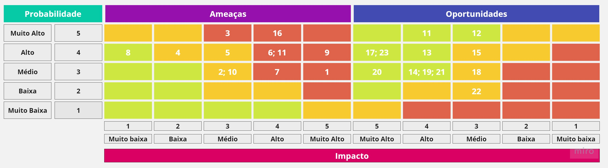

### Riscos

1. Danificar o TurtleBot 3
2. Demora do parceiro fornecer materiais necessários
3. Incapacidade de realizar testes fidedignos à demanda do projeto
4. Queima de componentes eletrônicos
5. Conflito de merge no GIT
6. Ausência de membros
7. Falta de comunicação
8. Incerteza com a expectativa dos professores em relação aos entregáveis
9. Baixa precisão dos sensores utilizados
10. Diferença entre repertório acadêmico entre os membros
11. Falta de rotatividade das funções do projeto

### Oportunidades

12. O MVP ser adotado pelo parceiro
13. Redução significativa de acidentes nas inspeções de rotina
14. Teste in loco (Gerdau) do MVP
15. Mapeamento bem-sucedido como adicional ao projeto
16. Impossibilidade de instalar as referências necessárias nos espaços confinados para corrigir a trajetória do robô
17. Conscientização, por parte do nosso grupo, da relevância da segurança para a continuidade de processo e ganhos em produtividade
18. Integração da solução com nova tecnologia 5G
19. Aumento significativo para o objetivo de risco zero
20. Melhoria no planejamento de inspeções
21. Redução do tempo de inspeção
22. Aumento da quantidade de dados sobre a infraestrutura fabril.
23. Melhoria no monitoramento de riscos

### Mitigação de riscos

1. Devemos estudar e planejar previamente nossas interações de hardware com o TurtleBot3, além de garantirmos um funcionamento correto na simulação antes de executarmos na prática.
2. Devemos estar em contato recorrente com o parceiro e tirar dúvidas relacionadas ao desenvolvimento do projeto sempre que necessário.
3. O grupo de desenvolvimento do projeto deve sempre estar alinhado com os conhecimentos de pré-requisitos necessários para a realização dos testes e da integração dos pontos do projeto como um todo.
4. O Grupo deve orientar-se sobre o funcionamento dos componentes eletrônicos que serão utilizados no projeto, e na hora da implementação desses no sistema, devem procurar orientação do técnico de laboratório ou professores.
5. Utilização do Merge Editor do VSCode para melhor compreensão do controle de versão dos arquivos e utilização de branches.
6. O grupo deve comunicar previamente as possíveis ausências para que uma nova organização de tarefas seja realizada levando em conta aquela ocasião
7. Realização de todas as cerimônias do Scrum e utilização os grupos do Slack e WhatsApp
8. Devemos validar nossos entregáveis, com os professores avaliadores, sempre que houver dúvidas por parte do grupo
9. Tratamos os dados e verificamos possíveis vieses entre os sensores, além de aumentarmos as margens de condição para identificar algum problema durante a fiscalização do espaço.
10. Alinhamento geral da base dos autoestudos.
11. Planejamento e organização eficiente das tarefas antes do início das Sprints.

## Personas

As personas são representações fictícias de pessoas reais que são criadas com base em dados e informações obtidos por meio de entrevistas com o parceiro e pesquisas sobre a área de atuação. Elas são usadas para ajudar a equipe do projeto a entender melhor as necessidades, objetivos, desafios e comportamentos dos usuários finais do produto ou serviço. Com isso, é possível desenvolver soluções mais adequadas e personalizadas para atender às necessidades dos usuários.

No caso do projeto Donatello, as personas de João Cabral e Anna Colombo foram criadas a partir de informações obtidas em entrevistas com técnicos de manutenção e supervisores da Gerdau, bem como pesquisas sobre a indústria de aço longo e normas de segurança. Essas informações foram usadas para criar um perfil detalhado de cada persona, incluindo suas características demográficas, habilidades, experiências, desafios e objetivos.

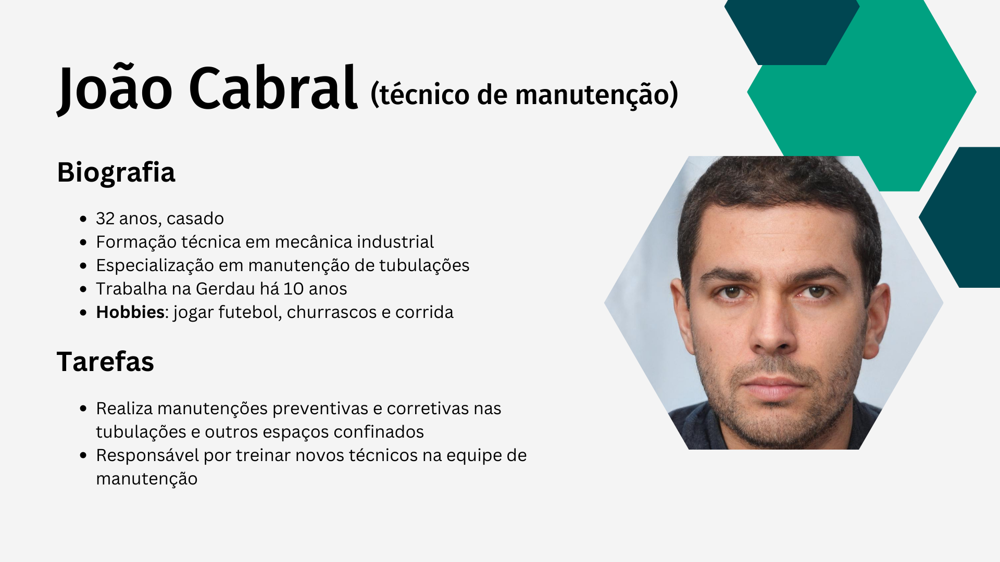
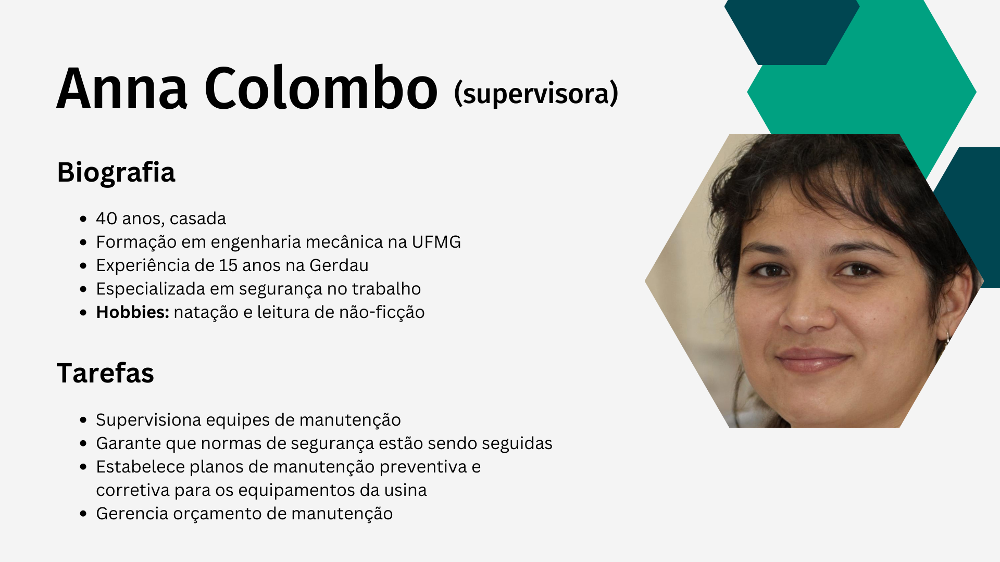

Ao criar essas personas, a equipe do projeto pode visualizar como o robô Donatello pode ser útil para João Cabral, por exemplo, permitindo que ele faça inspeções de tubulações com mais rapidez e segurança, além de facilitar a realização de manutenções preventivas e corretivas. Já para Anna Colombo, o robô pode ajudá-la a gerenciar melhor a segurança no trabalho, permitindo que ela faça planos de manutenção preventiva e corretiva para os equipamentos da usina de forma mais eficiente.

Com as personas definidas, a equipe do projeto pode entender melhor as necessidades e objetivos dos usuários finais e criar soluções personalizadas que atendam a essas necessidades de forma eficiente e eficaz.

## Canvas de proposta de valor

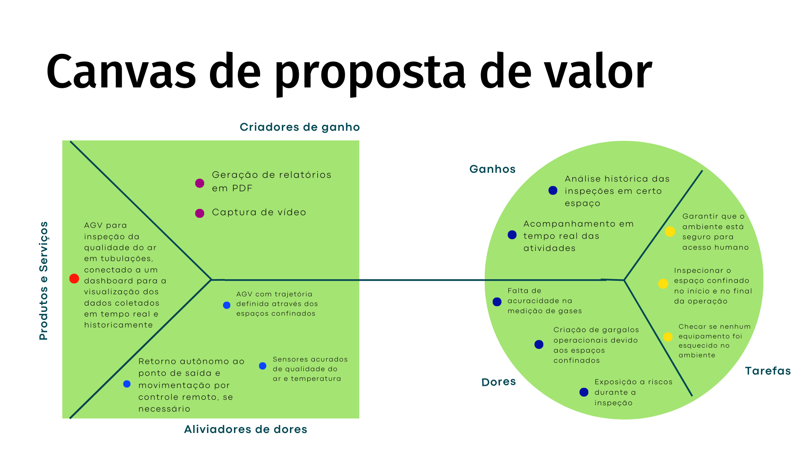

O canvas de proposta de valor é uma ferramenta utilizada para descrever de forma sucinta os principais elementos de uma oferta de produto ou serviço. Ele é composto por três categorias principais: tarefas, dores e analgésicos, que descrevem, respectivamente, as atividades que o cliente realiza, os problemas que enfrenta e as soluções que o produto ou serviço oferece.

Neste contexto, o canvas de proposta de valor foi utilizado para descrever uma solução de inspeção de espaços confinados para a Gerdau, utilizando um AGV conectado a um dashboard para visualização dos dados coletados em tempo real e historicamente. O objetivo dessa solução é garantir a segurança do ambiente durante a inspeção, além de aumentar a acuracidade na medição de gases e evitar gargalos operacionais.

Para isso, foram identificadas as principais tarefas que precisam ser realizadas, como garantir a segurança do ambiente, inspecionar o espaço confinado no início e no final da operação, e checar se nenhum equipamento foi esquecido no ambiente. Em seguida, foram identificadas as dores, como a falta de acuracidade na medição de gases, a criação de gargalos operacionais devido aos espaços confinados e a exposição a riscos durante a inspeção.

Por fim, foram propostos os analgésicos, como sensores acurados de qualidade do ar e temperatura, retorno autônomo ao ponto de saída e movimentação por controle remoto, se necessário, e AGV com trajetória definida através dos espaços confinados. Além disso, foram identificados os criadores de ganho, como geração de relatórios em PDF e captura de vídeo, e os ganhos, como a análise histórica das inspeções em certo espaço e o acompanhamento em tempo real das atividades.

Com a utilização do canvas de proposta de valor, é possível ter uma visão geral da solução proposta, além de identificar de forma clara as principais necessidades do cliente e como o produto ou serviço pode atendê-las de forma eficiente e eficaz.

## User Stories

As User Stories desempenham um papel crucial no desenvolvimento ágil, colocando os usuários no centro das ações da solução. Elas auxiliam a equipe de desenvolvimento, tanto no aspecto essencial do projeto, como na estimativa do esforço dedicado a cada tópico, bem como no valor que trazem para o usuário final.

A seguir estão as User Stories desenvolvidas para o projeto Donatello, juntamente com seus respectivos épicos e prioridades:

Épico 1: Como técnico, quero que o robô adentre locais potencialmente tóxicos para garantir a segurança dos funcionários.

- Como técnico, desejo que o robô possua medidas de contingência para perda de sinal, evitando a necessidade de resgate manual. (Prioridade média)
- Como técnico, desejo obter o máximo de informações possíveis, com foco na medição de gases, para entender as condições de segurança instantâneas do espaço confinado. (Prioridade alta)
- Como técnico, desejo que o robô possua mecanismos de segurança para evitar danos a si mesmo e a terceiros. (Prioridade média)
- Como técnico, desejo que o robô possua opções tanto de controle autônomo quanto manual, para se adaptar a situações específicas. (Prioridade média)

Épico 2: Como supervisor, desejo uma interface gráfica para visualizar os dados obtidos pelo robô e auxiliar na minha tomada de decisão estratégica.

= Como técnico, desejo visualizar os dados obtidos pelo robô em tempo real, para agilizar a tomada de decisões. (Prioridade média)

- Como técnico, desejo armazenar rotas definidas para o deslocamento do robô para automatizar as inspeções. (Prioridade alta)
- Como técnico, desejo ter acesso ao histórico das missões para analisar os resultados das inspeções em um período maior de tempo. (Prioridade baixa)
- Como técnico, desejo ter acesso ao campo de visão do robô para verificar possíveis obstáculos. (Prioridade média)
- Como técnico, desejo um campo simulado do trajeto do robô para verificar sua localização. (Prioridade alta)

## Análise financeira

Para a análise financeira do projeto que envolve a implementação de um AGV, foram considerados os principais fatores que afetam os custos: a compra do robô e a implementação técnica do mesmo, que será realizada por uma equipe de engenheiros.

No que se refere à implementação técnica, foram estimados os custos com base no trabalho de três engenheiros que irão trabalhar durante um período de quatro meses, com uma carga horária semanal de 40 horas. Utilizando o valor/hora médio de engenharia, que é de R$ 200, é possível calcular o custo total da implementação técnica.

Quanto ao custo do hardware do AGV, foi utilizado como modelo um robô de inspeção de tubulação sanitária, que possui funções e equipamentos semelhantes ao robô que será utilizado no projeto. Com base no custo do equipamento de referência mencionado, é possível estimar o custo do hardware do AGV.

Com essas informações, é possível fazer uma estimativa mais detalhada dos custos envolvidos na implementação do AGV no projeto, considerando tanto o custo da implementação técnica como o custo do hardware do robô.

 

 

# Entendimento de metadesign

## Fatores mercadológicos

### Orientação ao mercado e precificação

Os AGVs são veículos automatizados que seguem uma trajetória previamente definida. Eles são capazes de transportar grandes cargas de forma repetitiva, com sensores e câmeras para evitar colisões, e podem ser usados em ambientes confinados onde há riscos à segurança dos trabalhadores.

Pensando nisso, o projeto do robô Donatello trata-se de um AGV para monitoramento e inspeção de espaços confinados. Visa diminuir a exposição dos funcionários da Gerdau a perigos como níveis de oxigênio prejudiciais e gases tóxicos. Nesse sentido, o Donatello utiliza visão computacional, sensores e gravações do ambiente para identificar a situação atual desses espaços sem a presença física de um técnico.

Além disso, o Donatello se orienta ao mercado no atendimento de demandas por segurança e eficiência. Sua aplicação está diretamente relacionada ao conceito de Indústria 4.0, pois, com ele, pode-se otimizar processos produtivos através da captura de dados em tempo real para auxiliar na tomada de decisão. A tendência mercadológica é comprovada pela Confederação Nacional da Indústria, que aponta que 48% da indústria brasileira pretende investir na Indústria 4.0 nos próximos anos (“Crescimento do investimento na Indústria 4.0”, [s.d.]).

No que tange à precificação, em geral, AGVs tendem a variar entre US$40.000 e US$200.000 (“How much does an AGV cost?”, [s.d.]), dependendo do tipo de navegação, bateria, carregamento, peso suportado, altura atingida, etc. Ainda, considera-se também o investimento para a implementação do robô nos processos da empresa, o que inclui treinamento de pessoal, instalação de referências para o movimento (trilhos, fitas, QR codes, etc), integração com os sistemas vigentes, entre outros.

No caso do Donatello, a precificação incluirá os custos do TurtleBot3, dos sensores utilizados, dos utensílios de hardware empregados para sua fabricação e hospedagem online do dashboard. Igualmente, deve-se também considerar o investimento para implementação da solução na Gerdau.

### Cenário do mercado

O projeto abrange o cenário do mercado de automação e robótica industrial, com foco em aplicações para ambientes de espaço confinado e inspeção estrutural.

Nesse sentido, aponta-se que o mercado global de robótica industrial está em constante expansão, com um crescimento estimado de US$ 25 bilhões em 2021 a US$ 260 bilhões em 2030, segundo um relatório da BCG (Boston Consulting Group) (ARTES, 2022). No Brasil, a tendência mercadológica é explicitada ao utilizarem-se cada vez mais robôs como o da companhia Vale, por exemplo, que adquiriu um cão-robô para fiscalizar zonas de mineração e seus espaços confinados, como tubulações, galerias e drenos (“Vale investe em robôs para retirar empregados de situação de risco e aumentar a segurança de suas operações”, [s.d.]). Desse modo, a crescente demanda por eficiência e segurança nas operações industriais têm impulsionado a adoção de robôs em diversos setores, como o petroquímico, de energia, construção civil e mineração.

Em ambientes confinados, onde o acesso humano é limitado ou arriscado, a utilização de robôs tem se mostrado uma solução promissora para aumentar a segurança e a eficiência. De fato, apenas na América Latina, espera-se que o mercado de AGVs, para esse e outros fins, chegue a US$ 963,8 milhões até 2026.

Nesse contexto, o projeto é especialmente relevante para a Gerdau, a qual tem como valores fundamentais a inovação constante em processos produtivos para maximizar a segurança de seus funcionários (“Sobre nós”, [s.d.]). Com a introdução de inspeções automatizadas antes e depois de sessões de manutenção, será possível atingir níveis ainda maiores de qualidade de ambiente de trabalho e satisfação de seus operários, além de aumentar a eficiência e produtividade da companhia.

### Visão do projeto proposto

A visão da Gerdau de "ser global e referência nos negócios em que atua" (“Missão, Visão e Valores, uma forma poderosa de dar foco, inspirar, motivar e engajar pessoas!”, [s.d.]) é um dos pilares da estratégia da empresa para manter sua posição de liderança no setor de aço longo. Para alcançar esse objetivo, a empresa está sempre em busca de soluções inovadoras e tecnologias avançadas que possam melhorar seus processos e aumentar sua eficiência operacional.

Nesse contexto, a adoção do robô de inspeção Donatello se alinha perfeitamente com a visão da empresa. Ele tem o potencial de revolucionar a maneira como a Gerdau realiza inspeções, proporcionando serviços de inspeção ágeis, precisos e eficientes que aumentam a segurança e a produtividade e reduzem custos.

Além disso, a potencialidade projetual do produto é elevada, uma vez que a indústria de aço longo demanda soluções de inspeção de espaços confinados. No Brasil, a legislação de segurança e saúde do trabalhador é regida pela Norma Regulamentadora 1 (NR-1), que estabelece disposições gerais sobre as demais NRs e define as responsabilidades dos empregadores e trabalhadores em relação à segurança e saúde no trabalho. Nela, é evidenciado o fato de que o bem-estar dos funcionários deve ser prioridade para qualquer companhia.

Portanto, a adoção do robô de inspeção Donatello pela Gerdau não só contribuiria para o alcance de sua visão de ser uma empresa global e referência em seus negócios, mas também seria uma escolha estratégica que trará benefícios significativos para seus processos operacionais e para a segurança dos trabalhadores.

## Sistema produto-design

### Missão do projeto

A missão da Gerdau de "gerar valor para nossos clientes, acionistas, equipes e a sociedade, atuando na indústria do aço de forma sustentável" (GIFE, [s.d.]) está intrinsicamente ligada ao nosso produto. O Donatello oferece muitas vantagens para a Gerdau alcançar sua missão, por ser mais rápido, eficiente, preciso e seguro em inspecionar espaços confinados, enquanto reduz o impacto ambiental.

Os robôs de inspeção substituem os humanos em muitas tarefas, o que pode reduzir o número de acidentes e o número de variáveis envolvidas, diminuindo a quantidade de erros nos processos de produção e, consequentemente, diminuindo o desperdício e consumo de energia. Isso também limita a pegada de carbono das operações industriais. Além disso, produtos como o Donatello ajudam a identificar e resolver potenciais problemas de manutenção antes que se agravem, o que pode reduzir a necessidade de reparos ou substituições de equipamentos.

Em conclusão, ao adotar uma solução de inspeção inovadora e de alta qualidade, a Gerdau contribui para a realização de sua missão, melhorando a qualidade e segurança, reduzindo o impacto ambiental e gerando valor para seus clientes, stakeholders e equipes.

### Unidade formal entre o design do produto, as formas de divulgação e venda

O design físico do produto é de um robô de inspeção para espaços confinados que, a partir de sensores e câmeras, coletará dados sobre gases da atmosfera local, e filmagens sobre a higidez da estrutura inspecionada. A princípio, o robô não possuirá funcionamento autônomo.

O design ideológico do produto é de um instrumento que, diminuindo a exposição desnecessária de trabalhadores humanos a riscos industriais, edifique a imagem da empresa cliente como uma instituição que valoriza acima de tudo a vida humana; que, com imanência, preza pela constante melhora do ambiente em que operam seus trabalhadores; que investe em tecnologias que esse fim ajudem a alicerçar, e não apenas por lucro, mas por um futuro melhor; e não apenas para eles, mas para todos.

Como unidade formal, ambos os lados do design unem-se unilateralmente como um austero ideal que adquire materialidade através da inovação tecnológica; da aplicação bem-sucedida de princípios da robótica e da Indústria 4.0; para fins tanto capitalistas quanto humanitários.

Marx enfatizou que uma commodity nunca é apenas um simples objeto meramente para compra e consumo; uma commodity é um objeto carregado de qualidades ideológicas e metafísicas, cuja presença sempre reflete uma transcendência invisível (MARX; REGINALDO SANT'ANNA, 2008). Com base nesse fato, a execução da segunda unidade formal, constituída pelo design supramencionado unido a fatores de divulgação e marketing, revela-se: através de tais lentes, o produto pode ser facilmente publicizado e comercializado; não apenas um robô para uso meramente utilitário, mas sim um meio de contribuir para com a evolução das condições trabalhistas como um todo na indústria brasileira.

### Sustentabilidade ambiental

Com a aplicação do nosso projeto, nosso principal objetivo é a redução de acidentes na planta industrial em que nossa tecnologia for aplicada, reduzindo o risco de vazamento de gases para fora da tubulação e até mesmo evitando a explosão de gases inflamáveis, o que resultaria em um aumento de CO2 na atmosfera.

Além disso, temos como um dos possíveis ganhos o aumento da produtividade, tanto das operações quanto dos trabalhadores em espaços confinados. Em um primeiro momento, garantimos a segurança do local onde o trabalhador realizará a operação. Caso alguma irregularidade seja encontrada, transmitimos a informação em tempo real para o trabalhador, permitindo que ele inicie imediatamente o protocolo mais adequado para aquela ocorrência.

Por fim, Donatello é um AGV movido por baterias recarregáveis, diminuindo o impacto ambiental no fornecimento de energia em comparação com combustíveis fósseis. Com isso, será possível aumentar a eficiência de toda a operação em que este projeto for aplicado, resultando em um produto ecoeficiente.

### Proposta inovadora

Uma excelente forma de ampliar a inovação nesse projeto seria implementar a transmissão dos vídeos em tempo real para óculos de Realidade Aumentada (RA) de última geração, com tecnologia de ponta. Isso proporcionaria ao técnico uma experiência inspecionando o ambiente de maneira imersiva e aprimorada, ampliando sua percepção e entendimento do espaço confinado. Essa tecnologia não só seria aplicável para as inspeções pré e pós-manutenção, mas também para o treinamento de novos técnicos, permitindo que eles adquiram conhecimentos e se familiarizem com o ambiente antes mesmo de adentrá-lo.

O uso de óculos de RA possibilitaria que outras pessoas, como engenheiros e gestores, visualizassem a inspeção em tempo real de forma mais detalhada e abrangente, facilitando a tomada de decisões mais informadas. Essa inovação pode trazer uma grande vantagem competitiva para a empresa, acrescentando valor ao produto final e potencializando a eficiência do processo de manutenção.

Além disso, é importante salientar que o uso de tecnologia de ponta como essa pode melhorar a segurança dos funcionários, reduzindo o risco de acidentes de trabalho em áreas confinadas e diminuindo a necessidade de interrupção do trabalho para correção de problemas. A implementação dessa tecnologia pode, portanto, não apenas ser benéfica para a empresa, mas também para a segurança e bem-estar de seus funcionários.

A realidade aumentada também apresenta uma série de aplicações promissoras em outras indústrias. Por exemplo, no setor de arquitetura e construção, os óculos de RA podem ser usados ​​para visualizar modelos em 3D de edifícios e estruturas em tempo real, permitindo que os arquitetos e engenheiros analisem e façam ajustes precisos antes da construção física, economizando tempo e recursos.

Na área da medicina, a realidade aumentada pode ser empregada para ajudar cirurgiões durante procedimentos complexos. Os óculos de RA podem fornecer informações em tempo real sobre a anatomia do paciente, orientações cirúrgicas e dados vitais, permitindo uma intervenção mais precisa e reduzindo os riscos envolvidos.

### Possibilidades de reuso

A solução apresentada para o projeto Donatello possui diversas possibilidades de reuso em diferentes contextos e setores. O robô de inspeção para espaços confinados, com sua capacidade de coletar dados precisos, monitorar gases e garantir a segurança dos trabalhadores, pode ser aplicado em uma variedade de ambientes industriais, como refinarias, plantas químicas, instalações de petróleo e gás, entre outros. Além disso, a interface gráfica e as funcionalidades de visualização em tempo real dos dados coletados podem ser adaptadas para atender às necessidades específicas de diferentes setores.

Nesse sentido, alguns exemplos de reuso incluem:

1. Inspeção de Infraestrutura: O robô Donatello pode ser adaptado para realizar inspeções em pontes, viadutos, estruturas de edifícios e outras infraestruturas. Ele poderia detectar danos, fissuras, desgaste e anomalias estruturais, permitindo uma avaliação mais precisa da integridade dessas estruturas e facilitando o planejamento de manutenção preventiva.

2. Setor Petrolífero e de Gás: Além dos espaços confinados em refinarias e instalações de petróleo e gás, o Donatello pode ser utilizado para inspecionar oleodutos, gasodutos e plataformas offshore. Ele seria capaz de identificar vazamentos, corrosão, falhas de isolamento e outros problemas, garantindo a segurança operacional e reduzindo o risco de danos ambientais.

3. Inspeção Industrial: A solução pode ser aplicada na inspeção de equipamentos industriais, como caldeiras, tanques de armazenamento, tubulações e máquinas de grande porte. O robô Donatello seria capaz de acessar áreas de difícil alcance e coletar dados para monitorar o desempenho, detectar falhas e auxiliar na manutenção preditiva, garantindo a eficiência e prolongando a vida útil dos equipamentos.

4. Setor de Energia Renovável: Em parques eólicos e usinas solares, o Donatello poderia ser utilizado para inspecionar turbinas eólicas, painéis solares e outros componentes. Ele seria capaz de identificar falhas, sujeira excessiva, danos físicos e outras questões que afetam a eficiência e a produção de energia renovável.

# Arquitetura do sistema

A arquitetura da solução para o projeto de AGV de inspeção de espaços confinados será composta por três principais elementos: hardware, software e comunicação. O hardware incluirá o próprio AGV, equipado com sensores de colisão, sensores de gás e câmeras de vídeo. O software será responsável por controlar o movimento do AGV, detectar obstáculos e alterar a rota do AGV quando necessário. Também será responsável pela interface com o usuário, permitindo o controle remoto do AGV e a visualização dos dados e relatórios gerados durante a inspeção. Por fim, a comunicação será realizada via rede sem fio, permitindo a transmissão dos dados e relatórios gerados em tempo real para o gestor responsável pelo monitoramento do sistema. Com essa arquitetura, o sistema será capaz de realizar a inspeção de forma autônoma, segura e eficiente, proporcionando ao usuário final a tranquilidade e agilidade necessárias para a realização de uma manutenção confiável.

## Requisitos funcionais e não funcionais

### Funcionais

**Detecção de gases tóxicos em diferentes pontos no espaço confinado:**
O sistema deve ser capaz de monitorar as condições atmosféricas em várias áreas do espaço confinado, proporcionando informações precisas sobre a presença de gases tóxicos. Essa funcionalidade permite que os técnicos avaliem os riscos e tomem medidas adequadas para garantir a segurança durante as atividades de manutenção.

**Inspeção antes e após a manutenção:**
O sistema deve permitir a realização de inspeções detalhadas antes e depois das atividades de manutenção. Essa funcionalidade ajuda a documentar o estado do espaço confinado ao longo do tempo, fornecendo um histórico útil para análises posteriores e planejamento de manutenção futura.

**Uso do LIDAR para detectar obstáculos e evitar colisões:**
O sistema deve utilizar tecnologia LIDAR (Detecção e Alcance por Luz) para detectar obstáculos no ambiente do espaço confinado e evitar colisões. O LIDAR permite ao sistema criar um mapa digitalizado do ambiente em tempo real, identificando com precisão a presença de objetos que possam representar riscos para o robô de inspeção.

**Movimentação determinada por sequência de pontos em mapa digitalizado do ambiente:**
O sistema deve utilizar o mapa digitalizado do ambiente para planejar a movimentação do robô de inspeção. O robô deve seguir uma sequência de pontos pré-determinada, garantindo uma cobertura completa do espaço confinado durante a inspeção. Essa funcionalidade permite uma navegação eficiente e precisa do robô.

**Dashboard com apresentação dos dados coletados em tempo real:**
O sistema deve fornecer um dashboard que apresente os dados coletados durante a inspeção em tempo real. O dashboard ajuda os técnicos e gestores a acompanhar o progresso da inspeção e tomar decisões informadas com base nos dados atualizados.

**Dashboard com vídeo em tempo real:**
Além dos dados coletados, o sistema deve fornecer um dashboard que exiba vídeo em tempo real da inspeção. Isso permite que os técnicos e gestores visualizem a inspeção de forma remota, facilitando a compreensão das condições do espaço confinado e auxiliando na tomada de decisões.

### Requisitos não funcionais
**Performance otimizada para garantir a eficiência do processo de inspeção:**
O sistema deve ser otimizado para executar as inspeções de forma eficiente, garantindo uma taxa de sucesso de pelo menos 95%. Isso inclui a capacidade de processar rapidamente os dados coletados, gerar relatórios e fornecer respostas em tempo real.

**Confiabilidade na detecção de condições atmosféricas:**
O sistema deve ser altamente confiável na detecção da presença de gases tóxicos. A margem de erro para essas medições deve ser no máximo 5%, garantindo a precisão e a segurança durante a inspeção.

**Funcionamento confiável em ambientes com falta de regularidade (tubulações):**
O sistema deve ser capaz de operar de forma confiável em ambientes com falta de regularidade, como tubulações. Ele deve ser capaz de navegar nessas áreas com uma margem de erro de no máximo 10%, garantindo a cobertura completa do espaço confinado durante a inspeção.

**Rápido tempo de resposta na detecção de obstáculos:**
O sistema deve ser capaz de detectar obstáculos com rapidez, respondendo em no máximo 1 segundo. Isso ajuda a evitar colisões e garante a eficiência da inspeção.

**Confiança na precisão da detecção de obstáculos:**
O sistema deve ser altamente preciso na detecção de obstáculos, com pelo menos 95% de precisão. Isso assegura que o robô de inspeção possa identificar corretamente os obstáculos e tomar medidas adequadas para evitá-los.

**Interação com usuário intuitiva:**
A interface do sistema deve ser intuitiva e fácil de usar para os usuários finais, incluindo os executantes da manutenção e os gestores. Isso facilita o entendimento das informações apresentadas no dashboard, a interpretação dos dados coletados e a tomada de decisões com base nas informações fornecidas.

## Viabilidade técnica

Para que haja uma implementação, então, do AGV Donatello, é necessário considerar alguns aspectos técnicos, como a escolha dos sensores, do hardware e do software e suas limitações. O hardware principal utilizado, como já citado, será o Donatello, que é um módulo robótico TurtleBot3, e apesar de ser um sistema com baixo custo de implementação e versátil ele pode ter velocidade e autonomia reduzidas dado limitações do seu processador embarcado. No caso dos sensores, serão utilizados sensores capazes de medir condições atmosféricas e detectar obstáculos, e como as tubulações serão consideradas superfícies planas por conta da prototipação do sistema para a locomoção do robô, poderá haver algumas limitações na detecção de alguns obstáculos nesse espaço, como pequenos detritos e declives à sua frente e abaixo, por exemplo.

Considerando-se ainda a aquisição de dados físicos do espaço, para a medição de condições atmosféricas, serão utilizados sensores de temperatura, de oxigênio e de gases tóxicos, e tais sensores podem ter uma limitação quanto à resolução e precisão da aquisição dessas medições físicas. Em relação à detecção de obstáculos, será utilizado o sensor "LiDAR"(Light Detection and Ranging) que está embutido no módulo robótico TurtleBot3, um sensor capaz de detectar obstáculos por meio da emissão de laser na banda do infravermelho próximo, mas pode ser que as tubulações dificultem a aquisição de dados do ambiente e um grande volume de dados pode interferir no processamento desse sensor também. Além disso, como um monitoramento com a identificação das condições ambientais em tempo real agrega valor ao projeto, será utilizada uma câmera para a captação das imagens e transmissão das condições em tempo real para os operadores, contudo, dependendo da iluminação do ambiente, o envio das imagens pode ser prejudicado.

Por fim, o software utilizado para controlar o roteamento da movimentação robótica no ambiente será feita pelo ROS (Robot Operating System), que é um meta sistema operacional que fornece uma estrutura de desenvolvimento, gerenciamento e execução de aplicações robóticas, no entanto, por ser uma tecnologia mais recente e está em constante evolução, a implementação deste software traz uma complexidade maior para a simulação e, além disso, pode apresentar também vulnerabilidades de segurança ao usar um ambiente de rede compartilhada.

## Proposta geral

O objeto da proposta geral do sistema é o desenvolvimento de um AGV (Automated Guided Vehicle) para inspeção pré-manutenção e pós-manutenção de espaços confinados, com foco em tubulações. O sistema será capaz de examinar as condições atmosféricas em diferentes pontos, detectar a presença de gases e a quantidade de oxigênio, além de alertar o operador sobre possíveis obstáculos para sua locomoção na tubulação. A interface com dados e vídeo em tempo real permitirá a geração de relatórios em PDF e vídeos da inspeção. O sistema será projetado para melhorar as condições de segurança do operador e a eficiência do processo de inspeção, reduzindo o tempo necessário para realizar a inspeção e evitando a possibilidade de esquecimento de ferramentas ou equipamentos no interior dos tubos. O usuário final do sistema será o executante da manutenção, enquanto o usuário indireto será o gestor responsável por visualizar os dados e relatórios gerados pelo sistema.

## Diagrama de blocos (versão 1)

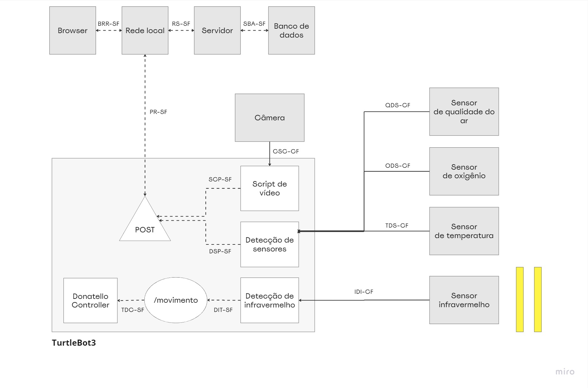

 

**Legenda**

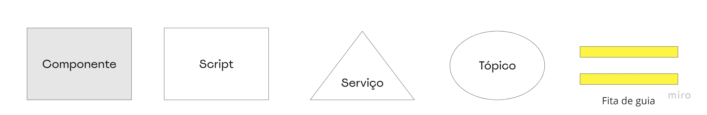

 

### Tabela de componentes

| Componente / Conexão                                                   |                                                                                                                                               Descrição da função                                                                                                                                               | Tipo                    |
| ---------------------------------------------------------------------- | :-------------------------------------------------------------------------------------------------------------------------------------------------------------------------------------------------------------------------------------------------------------------------------------------------------------: | ----------------------- |
| TurtleBot3                                                             |                          Veículo automaticamente guiado que transporta a câmera e os sensores pelo espaço confinado a fim de se averiguar as condições de segurança para certa operação. Utiliza ROS2 como software de controle e fitas de guia como referência para sua movimentação.                          | AGV                     |
| Script de vídeo                                                        |                                                                                                             Recebe o vídeo capturado pela câmera e o processa para envio ao servidor em tempo real                                                                                                              | Script/nó               |
| Detecção de sensores                                                   |                                                                                                                  Recebe inputs dos sensores e os processo para envio ao servidor em tempo real                                                                                                                  | Script/nó               |
| Detecção de infravermelho                                              |                                                                                        Recebe leituras do sensor de infravermelho sobre as fitas de guia e corrige o movimento segundo a trajetória previamente definida                                                                                        | Script/nó               |
| POST                                                                   |                                                                                                                                Realiza requisições do tipo POST para o servidor                                                                                                                                 | Serviço ROS2            |
| /movimento                                                             |                                                                                        Tópico onde o script de infravermelho posta comandos de movimentação para o controlador do robô, que é um subscriber nesse tópico                                                                                        | Tópico ROS2             |
| DonatelloController                                                    |                                                                                                                                Script que controla a movimentação do robô em si                                                                                                                                 | Script/nó               |
| Câmera                                                                 |                                                                                                                                        Câmera para gravação da operação                                                                                                                                         | Entrada                 |
| Sensor de qualidade do ar                                              |                                                                                                                                     Sensor para detectar gases no ambiente                                                                                                                                      | Entrada                 |
| Sensor de oxigênio                                                     |                                                                                                                             Sensor para medir a quantidade de oxigênio no ambiente                                                                                                                              | Entrada                 |
| Sensor de temperatura                                                  |                                                                                                                        Sensor para medir a temperatura em diferentes pontos do ambiente                                                                                                                         | Entrada                 |
| Sensor de infravermelho                                                |                                                                                                              Sensor para identificar as fitas de guia na superfície e corrigir o movimento do robô                                                                                                              | Entrada                 |
| Rede local, browser, servidor e banco de dados                         | Interface gráfica do sistema, pela qual o usuário se comunicará com o robô. A interação do usuário final ocorre no browser, que envia as informações ao servidor. O servidor, por sua vez, comunica-se com o banco de dados para assegurar a persistência dos inputs e os redireciona ao hardware (TurtleBot3). | Interface gráfica/saída |
| QDS-CF (sensor de qualidade do ar e detecção de sensores - com fio)    |                                                                                                       O sensor de qualidade do ar envia leituras do ambiente para o script do Raspberry Pi no TurtleBot3                                                                                                        | Conexão                 |
| ODS-CF (sensor de oxigênio e detecção de sensores - com fio)           |                                                                                                           O sensor de oxigênio envia leituras do ambiente para o script do Raspberry Pi no TurtleBot3                                                                                                           | Conexão                 |
| TDS-CF (sensor de temperatura e detecção de sensores - com fio)        |                                                                                                         O sensor de temperatura envia leituras do ambiente para o script do Raspberry Pi no TurtleBot3                                                                                                          | Conexão                 |
| IDI-CF (sensor de infravermelho e detecção de infravermelho - com fio) |                                                                                                     O sensor de infravermelho envia leituras das fitas de guia para o script do Raspberry Pi no TurtleBot3                                                                                                      | Conexão                 |
| CSC-CF (câmera e script de câmera/vídeo - com fio)                     |                                                                                                                 A câmera envia imagens coletadas para o script de processamento no Raspberry Pi                                                                                                                 | Conexão                 |
| SCP-SF (script de câmera/vídeo e serviço de POST - sem fio)            |                                                                                                      O script da câmera processa os frames do vídeo e os encaminha para o servidor através do serviço POST                                                                                                      | Conexão                 |
| DSP-SF (detecção de sensores e serviço de POST - sem fio)              |                                                                                                       O script de sensores processa as leituras e as encaminha para o servidor através do serviço de POST                                                                                                       | Conexão                 |
| DIT-SF (detecção de infravermelho e tópico - sem fio)                  |                                                                                                          O script de infravermelho envia correções de movimento para o tópico de movimentação do robô                                                                                                           | Conexão                 |
| TDC-SF (tópico e Donatello Controller - sem fio)                       |                                                                                                        O Controller é um subscriber no tópico e utiliza as mensagens para modificar o movimento do robô                                                                                                         | Conexão                 |
| PR-SF (POST e rede local - sem fio)                                    |                                                                                                            O serviço de POST faz requisições HTTP do tipo POST para o servidor através da rede local                                                                                                            | Conexão                 |
| BRR-SF (Browser e rede local - sem fio)                                |                                                                                                               A interface gráfica é acessada através do browser, na rede local conectada ao Wi-Fi                                                                                                               | Conexão                 |
| RS-SF (Rede local e servidor - sem fio)                                |                                                                                                           A rede local se conecta com o Wi-Fi e, através dele, com o servidor para fazer requisições                                                                                                            | Conexão                 |

## Diagrama de blocos (versão 2)

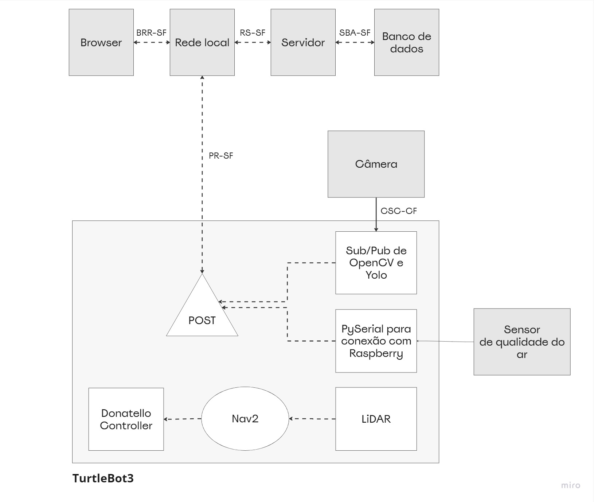

Ao final do projeto, redesenhamos o diagrama de blocos do Donatello com as atualizações realizadas no decorrer do módulo. As principais mudanças foram:

1. Criação de pub/sub para envio, processamento e upload de imagens da câmera;
2. Comunicação pyserial entre Arduino e Raspberry Pi do TurtleBot3, com postagem em HTTP para o servidor;
3. Navegação com Nav2, utilizando o sensor LiDAR para detectar obstáculos e contorná-los.

# Navegação e segurança

Utilizamos o ROS2 e o Gazebo para simular o funcionamento de um robô Turtlebot3 em um ambiente de inspeção de espaços confinados na Gerdau. Para viabilizar sua navegação seguindo uma rota pré-definida, empregamos também o Nav2.

O Nav2, abreviação de "Navigation2", é uma plataforma de navegação de código aberto desenvolvida para robôs autônomos. Ele é construído sobre o framework ROS (Robot Operating System) e objetiva facilitar a criação de sistemas de navegação robustos e eficientes, permitindo que os robôs se movam de forma autônoma em ambientes desconhecidos ou complexos. O Nav2 oferece uma variedade de recursos e algoritmos avançados, incluindo mapeamento, localização, planejamento de trajetória e controle de movimento.

A escolha do Nav2 em vez de realizar o controle de movimentação e transformação de bases manualmente se baseia em vários aspectos que garantem um sistema mais testado, confiável e eficiente. Durante a Sprint 2, optamos por desenvolver um código próprio para controlar o robô, porém, constatamos que ele não atingiu as expectativas esperadas. Verificamos que, em muitas situações, o código desenvolvido manualmente não funcionava conforme antecipado, apresentando falhas e imprecisões. Essa experiência levou-nos a buscar uma solução mais robusta e confiável, o que nos levou a adotar o Nav2.

Ao utilizar o Nav2, temos a garantia de utilizar um código bem estabelecido e comprovado, que já foi testado em uma variedade de cenários e ambientes. Isso proporciona uma maior confiabilidade em relação ao controle de movimentação e transformação de bases, pois ele foi refinado e aprimorado ao longo do tempo, com base em feedbacks e contribuições da comunidade de desenvolvedores. Além disso, o Nav2 é de código aberto, o que significa que podemos aproveitar as contribuições de outros desenvolvedores e acessar suporte da comunidade em caso de problemas ou dúvidas.

### Controle de navegação no Nav2

Interagimos com o Nav2 por meio de uma API em Python, que nos permite programar e controlar o comportamento do robô de forma intuitiva e flexível. Através dessa API, podemos acessar e utilizar os recursos oferecidos pelo Nav2, como mapeamento, localização, planejamento de trajetória e controle de movimento. Podemos enviar comandos para iniciar ou parar a navegação, definir metas de destino para o robô e receber informações sobre o estado atual da navegação.

A navegação no Nav2 envolve a interação de vários componentes-chave, como Action Servers, Planners, Controllers e Smoothers, para proporcionar uma experiência de navegação autônoma eficiente e suave.

O Nav2 utiliza Action Servers como uma abstração de alto nível para gerenciar as tarefas de navegação. Esses Action Servers atuam como intermediários entre os módulos do sistema de navegação, facilitando a coordenação e o controle de ações relacionadas à navegação, como o planejamento de trajetórias, o controle de movimento e a monitoração do progresso.

Os Planners desempenham um papel fundamental na navegação do Nav2, pois são responsáveis por calcular trajetórias e planejar os movimentos do robô. Eles utilizam informações do ambiente, como mapas e dados de localização, para gerar planos de navegação. Os Planners podem usar algoritmos avançados, como RRT (Rapidly-exploring Random Tree) ou A\* (A-estrela), para determinar a melhor rota possível, levando em consideração obstáculos, limitações de velocidade e preferências do usuário.

Os Controllers assumem a responsabilidade de executar os movimentos do robô com base nas trajetórias planejadas pelos Planners. Eles são responsáveis pelo controle de velocidade, aceleração e orientação do robô, garantindo que ele siga corretamente a trajetória definida. Os Controllers podem empregar técnicas de controle como controle PID (Proporcional, Integral e Derivativo) ou controle baseado em malha de realimentação para alcançar um movimento suave e preciso.

Além disso, o Nav2 também incorpora Smoothers, que têm a função de suavizar as trajetórias planejadas para melhorar a qualidade do movimento. Os Smoothers refinam as trajetórias geradas pelos Planners, ajustando os movimentos do robô para reduzir oscilações e tornar as transições entre as poses mais fluidas. Isso resulta em uma navegação mais suave e natural, evitando movimentos bruscos e melhorando a experiência geral do usuário.

### Segurança e sistema anticolisão

O Nav2, juntamente com os Recovery Servers, desempenha um papel fundamental como um sistema de segurança ao lidar com detecção e desvio de obstáculos durante a navegação autônoma. Para isso, nosso robô utiliza o sensor LiDAR, que permite a percepção do ambiente por meio da detecção de pontos no espaço.

Com base na quantidade de pontos percebidos pelo LiDAR, o Nav2 é capaz de avaliar a densidade e a proximidade de objetos em seu entorno. Essas informações são utilizadas para tomar decisões em tempo real, como diminuir a velocidade, parar completamente ou desviar do obstáculo detectado.

Quando uma grande quantidade de pontos é detectada pelo LiDAR, indicando uma alta densidade de objetos próximos, o Nav2 pode reduzir a velocidade do robô como medida preventiva. Essa redução da velocidade proporciona mais tempo para tomar decisões e ajustar o caminho, aumentando a segurança durante a navegação.

Se a densidade de pontos detectada pelo LiDAR aumentar significativamente, indicando um obstáculo iminente, o Nav2 pode acionar rotinas de recuperação para evitar a colisão. Essas rotinas podem incluir a parada completa do robô até que o obstáculo seja removido ou contornado, ou desviar da rota originalmente planejada, buscando uma trajetória alternativa que contorne o obstáculo de forma segura.

Além das rotinas de recuperação mencionadas anteriormente, o Nav2 possui uma variedade de outras estratégias para lidar com situações adversas durante a navegação autônoma.

Uma rotina comum é a verificação de bloqueios ou obstáculos persistentes no caminho do robô. Se o Nav2 detectar que o robô está preso ou incapaz de avançar devido a um bloqueio prolongado, ele pode executar uma ação de "clear path" (limpar o caminho). Essa rotina pode envolver tentativas de mover obstáculos menores ou contorná-los de forma segura, a fim de permitir que o robô prossiga em sua rota planejada.

Em casos em que a localização do robô se torna incerta ou imprecisa, o Nav2 pode empregar rotinas de "relocalização" para recuperar a estimativa correta de sua posição. Isso pode envolver a combinação de informações do LiDAR com dados de outros sensores, como odometria ou sistemas de localização simultânea e mapeamento (SLAM), para recalibrar a localização do robô e continuar a navegação com precisão.

Além disso, o Nav2 pode incorporar rotinas de "fail-safe" (segurança em caso de falha) para situações extremas. Se ocorrer um erro crítico ou falha no sistema, o Nav2 pode executar uma sequência de ações para garantir a segurança do robô e do ambiente circundante. Isso pode incluir a parada de emergência, desligamento seguro dos atuadores e a sinalização de um estado de falha para que operadores humanos possam intervir e resolver o problema.

Essas rotinas adicionais de recuperação no Nav2 demonstram sua capacidade de lidar com uma ampla gama de situações desafiadoras durante a navegação autônoma. Através do uso inteligente de algoritmos e sensores, o Nav2 busca garantir a segurança do robô, adaptando-se e respondendo efetivamente a eventos inesperados, e permitindo uma navegação autônoma confiável e robusta.

#### Outras rotinas

Como parte das nossas futuras melhorias e aprimoramentos, planejamos desenvolver uma rotina adicional de recuperação no Nav2 para trazer o robô de volta ao ponto inicial em caso de emergência. Essa rotina será acionada em situações críticas ou eventos inesperados durante a navegação autônoma, garantindo que o robô possa retornar com segurança ao ponto de partida.

Além disso, também estamos considerando a implementação de um recurso de controle remoto para o robô. Isso permitirá que um operador humano assuma o controle do robô de forma remota, se necessário, em situações complexas ou específicas que exijam intervenção manual direta. Essa capacidade de controle remoto fornecerá uma camada adicional de flexibilidade e segurança, garantindo que o robô possa ser controlado de forma eficaz e precisa em diferentes cenários.

Com essas melhorias planejadas, buscamos aprimorar o sistema de navegação, tornando-o mais completo e robusto. Nosso objetivo é garantir a segurança do robô e do ambiente, possibilitando a recuperação rápida em caso de emergências e fornecendo opções de controle versáteis para atender a diversas necessidades durante a operação autônoma.

# Visão computacional

A nossa estratégia para identificar situações de alerta visual em espaços confinados, durante a inspeção realizada pelo nosso robô, envolve a utilização de técnicas de visão computacional com OpenCV em Python, aliadas ao modelo YOLOv8. Para a validação inicial, procedemos com o treinamento do modelo YOLOv8 para detecção de rachaduras em concreto.

[Colab - Treinamento de Modelo](https://colab.research.google.com/drive/1OOXB0qYBhixTvYTEjiQcAgIObV7JnHei?usp=sharing#scrollTo=DRyyJsTSnLHB)

Integramos esse modelo ao nosso backend por meio de uma API RESTful, garantindo a comunicação eficiente e segura entre a câmera acoplada ao Turtlebot e o nosso sistema. A ideia é que a câmera capture imagens periodicamente e as envie para o backend por meio dessa API, permitindo que sejam analisadas pelo algoritmo de detecção de rachaduras. O feedback resultante da detecção será apresentado tanto na interface gráfica, para uma visualização em tempo real, quanto registrado no log da inspeção.

Como próximos passos, planejamos explorar a viabilidade do streaming de vídeos em tempo real, possibilitando uma análise contínua das imagens capturadas pelo Turtlebot. Além disso, consideramos a implementação de um sistema de armazenamento para preservar os vídeos completos, possibilitando análises retrospectivas por meio do dashboard.

Essa abordagem combina técnicas avançadas de visão computacional, aprendizado de máquina e integração com o Turtlebot, fornecendo uma solução eficiente e confiável para a detecção de rachaduras em espaços confinados. A utilização do OpenCV e do modelo YOLOv8 visa aprimorar a eficiência e a precisão da detecção, resultando em informações valiosas para a manutenção e a segurança das estruturas inspecionadas.

## Pipeline de pré-processamento

O pré-processamento das imagens que serão analisadas através da Visão Computacional é um procedimento essencial para otimizar o tempo de execução e aumentar a acurácia da detecção de objetos. Ao final do procedimento teremos objetos mais nitidos, imagens com menos ruidos e normalizadas, a depender do contexto e necessidade de seu projeto.

Utilizando filtros de tratamento da biblioteca _OpenCV_, o primeiro passo é aplicar o filtro de **Equalização de Histograma**. Esse filtro tem a função de normalizar a intensidade de luminosidade de todos os pixels da imagem. Se a imagem possuir baixa intensidade de luz, o filtro aumenta essa intensidade para um nível normal; caso contrário, o filtro reduz a intensidade para o nível adequado.

Após esse primeiro processamento, é aplicado o filtro de **Escala de Cinza**. Esse filtro reduz os canais de cores da imagem, que originalmente são compostos por Vermelho, Verde e Azul (RGB), para apenas um único canal. Essa conversão para escala de cinza torna a imagem mais leve e acelera o processo de processamento.

Ao realizar o **pré-processamento** com esses filtros, é possível obter imagens mais adequadas para análise e detecção de objetos. Isso contribui para um tempo de execução mais eficiente e uma detecção de objetos mais precisa, além de que, através dessas etapas de pré-processamento, será possível preparar as imagens para os próximos passos da Visão Computacional, como a segmentação de objetos, extração de características e classificação, caso seja necessário em nosso projeto.

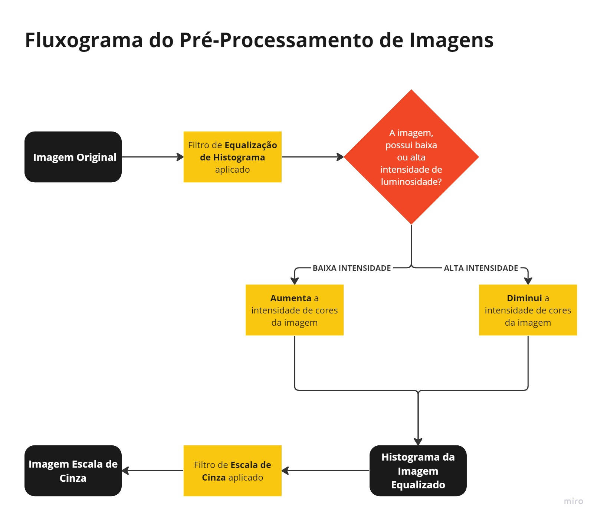

# Riscos e fluxo de erros

## Riscos relacionados a hardware

1.  Abastecimento de energia

    - O robô é abastecido por uma bateria de lipo recarregável.Ao chegar em um nivel de voltagem abaixo de 11V, ele emite um sinal sonoro constante que caso o robô nãos seja desligado ou recarregado o sinal vai se intensificando até chegar um ponto em que ele compromete a bateria permanentemente. A bateria também é muito sensivel a choques mecânicos podendo ocasionar em uma combustão caso seja manuseada de maneira imprópria.
     
     

     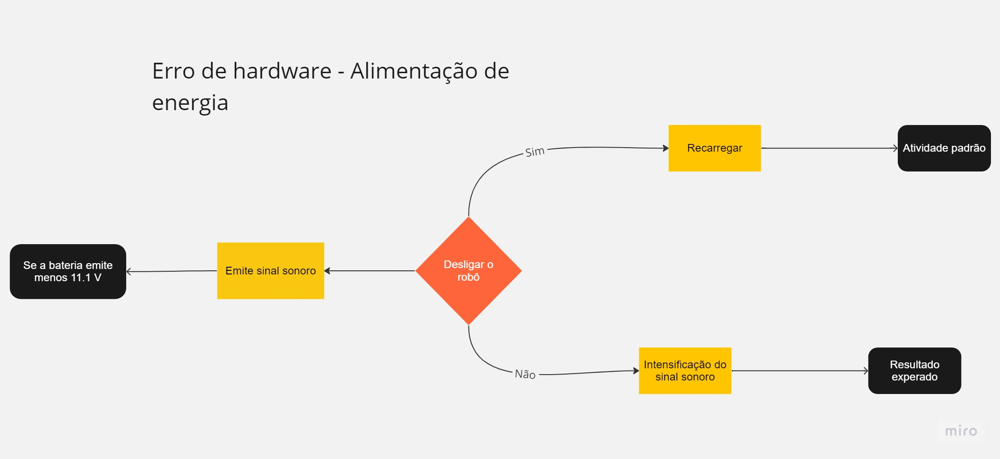
     

      

2.  Falha dos sensores utilizados

    - A falhas nos sensores utilizados pode ocasionar em uma informação irreal, mas para corrigir é implmentado via software parametros de apoio que serão analisados junto com os dados recebidos pelos sensores. Assim primeiro é avaliado se o dado não sofreu algum ruído ou interferência por algum outro erro de software e depois é avaliado a durabilidade e estado atual do sensor para indentificar uma falha permanente nas medições.
       
      

      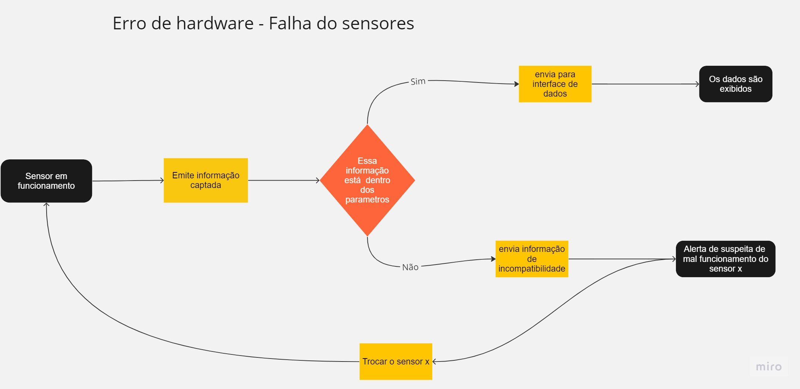
      

       

3.  Instabilidade mecânicas

    - O hardware após varios usos precisa passar por uma inspeção para indentificação do estado atual dos componentes como rodas, motores, placas de microcontroladores e outros. Portanto é possivel que o material do corpo do robô esteja desgastado e instável possibilitando o compromentimento de outros componentes que estão com uma vida util saudável.
       
      

      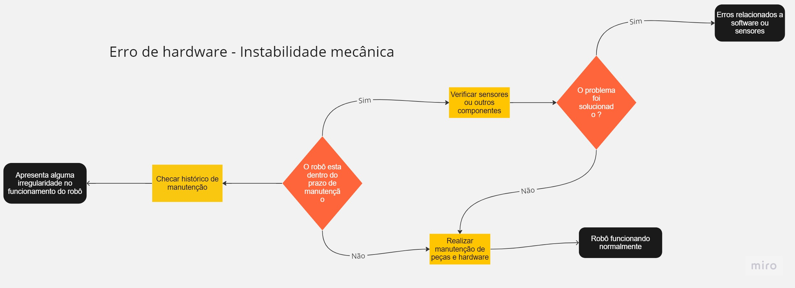
      

       

4.  Interferência de ambientes

    - O ambiente no qual o robô está inserido para uso afetará diretamente o hardware podendo levar a um erro de instabilidade mecânica, contudo existe interferências que possuem consequências imediatas para o hardware como campos eletromagnéticos que podem interfirir nos sensores e na comunicação dos microprocessadores podendo causar diversos problemas de software. Logo para evitar esses erros é necessário planejar o ensaio do uso e verificar se há uma possibilidade de ocorrência.
       
      

      
      

       

## Riscos relacionados a software

1. Configuração de desenvolvimento

   - A configuração do ambiente de desenvolvimento é fundamental para começar a execução do projeto, além de merecer uma antenção especial devido ao versionamento de bibliotecas e softwares que podem impactar no erro do compilamento e execução do código. Alguns softwares não funcionam em determinados sistemas operacionais como o próprio ros que é um meta sistema operacional que utiliza de kernels do linux.

2. Erro de mapeamento

   - O mapeamento utilizado pelos softwares como nav2 entre outros são softwares para mapear uma rota e possibilitar o deslocamento do robô. Contudo caso esses dados não sejam correspondentes com o dimensionamento do local onde ele sera aplicado, podem ocorrer erros de sobreposição de objetos e distorções de distancias e rotas.
    
   

   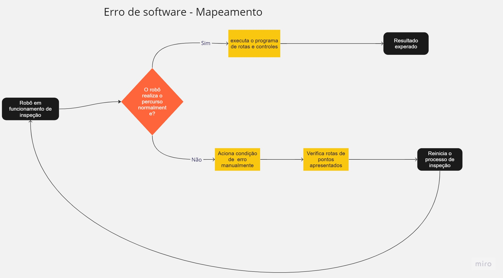
   

    

3. Problemas de comunicação

   - A comunicação entre os tópicos e os terminais e com microcontrolador é fundamental para o funcionamento adequado do hardware. Dessa forma caso ocorra um erro na comunicação entre um desses elementos pode houver perda ou o comprometimento de dados importantes que devem ser armazenados.
    
   

   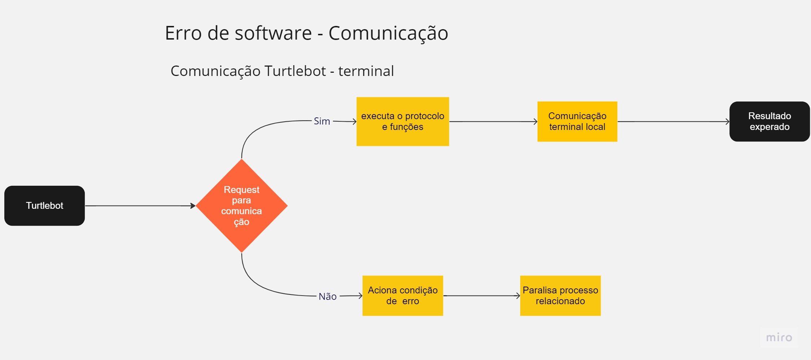
   

    
    
   

   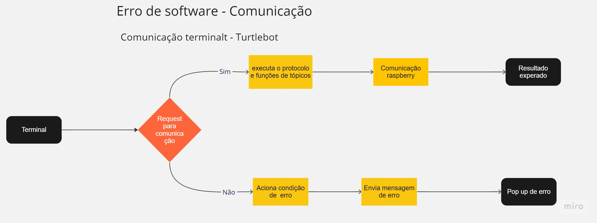
   

    

4. Conflito de dependências

   - O erro de conflitos de dependências pode ocorre posteriormente ao erro de configuração de ambiente, ele pode acontecer principalmente se o sitema de controle do robô for integrado a sistemas internos da empresa podendo não ser compativo com alguns pacotes aplicados no sistema ou que possuem a mesma atuação para funções diferentes.

# Desenvolvimento de interface gráfica

A interface a ser desenvolvida consiste em uma aplicação web responsiva que permitirá que os usuários monitorem o AGV de forma remota. A interface apresentará uma visualização em tempo real da câmera do AGV.

A interface também incluirá uma analise de gases para avaliar a qualidade do ar no ambiente em que o AGV está operando. Sensores de gás instalados no AGV serão responsáveis por detectar gases tóxicos ou inflamáveis e enviariam essas informações para a interface.

Em resumo, a interface permitiria que os usuários monitorem o AGV de forma remota e avaliem a qualidade do ar no ambiente, garantindo a segurança dos trabalhadores e do ambiente. Além de uma simulação em tempo real que apresenta um gemeo digital do dispositivo fisico.

## Tecnologias Utilizadas

A interface para o sistema de acompanhamento de câmera para um AGV com simulação e avaliação de gases no ambiente foi desenvolvida utilizando o framework Next.js e a biblioteca de componentes Ant Design.

Next.js é um framework de desenvolvimento web React que permite a criação de aplicativos web modernos e escaláveis. A escolha desse framework permitiu a criação de uma interface responsiva e fácil de usar, além de permitir a integração com outras tecnologias.

#### Documentação Next.js

https://nextjs.org/docs

Além disso, a interface utilizou a biblioteca de componentes Ant Design, que é uma coleção de componentes UI React prontos para uso e estilizados com um design moderno e limpo. A utilização dessa biblioteca permitiu a criação de uma interface visualmente atraente e consistente.

#### Documentação Ant Design

https://ant.design/components/overview/

## Mockup

O Figma é uma ferramenta de design de interface do usuário baseada na web que permite a criação de wireframes, protótipos e designs de alta qualidade. Com ele, é possível criar uma interface interativa e visualmente atraente para o sistema de acompanhamento de câmera para um AGV com simulação e avaliação de gases no ambiente.

Nesta seção, apresentamos o design dessa interface criada no Figma. Com base nas necessidades do sistema, o design foi criado para fornecer uma visualização clara da câmera do AGV, permitir uma avaliação da qualidade do ar no ambiente e a visualização de uma simulação do comportamento do dispositivo.

Nesta sprint, começamos implementando a tela principal, de monitoramento, para desktop. Pretendemos, nas próximas sprints, melhorar o design e incrementar a responsividade para telas menores.

- Link Figma: https://www.figma.com/file/FyAfyBx5iqYazfXmY6bth6/Untitled?type=design&node-id=0-1&t=K3TWAbWp9QWKRNlJ-0

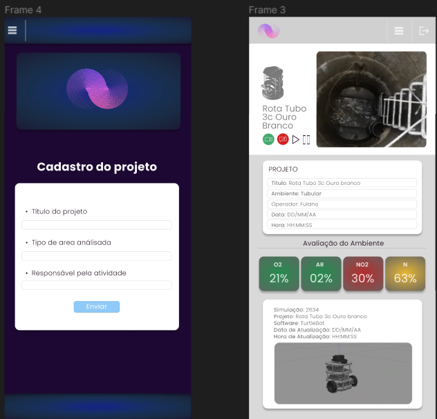

### Acionamento de Interface - Servidor com Next.js

1. Abra o terminal do seu sistema operacional.
2. Navegue até a pasta raiz do seu projeto, onde se encontra a pasta 'src' que contém a pasta 'frontend'
   `cd src/frontend`

3. Execute o comando 'npm install' para instalar todas as dependências do projeto.
   `npm install`

4. Após a instalação das dependências, execute o comando 'npm run dev' para iniciar o servidor de desenvolvimento do Next.js.
   `npm run dev`

5. Aguarde alguns instantes até que o servidor esteja pronto e acesse o endereço http://localhost:3000 no seu navegador.
6. A interface deverá ser exibida no seu navegador, permitindo que você visualize e interaja com a aplicação.

## Backend 

Estruturamos nosso backend utilizando o framework FastAPI, que nos permite criar APIs de forma rápida e eficiente. Todo o código está contido em um arquivo principal chamado main.py, que é responsável por iniciar o servidor.

Ao iniciar o servidor, temos acesso a várias rotas (ou endpoints) que nos permitem realizar diferentes operações. Essas rotas foram desenvolvidas para lidar com o registro de imagens, interação com o banco de dados e acesso aos registros de imagens e frames analisados por meio da visão computacional previamente implementada.

Uma das APIs principais é responsável por enviar as imagens analisadas pelo YoloV8 para o Supabase, um bucket online utilizado para armazenar e gerenciar os arquivos. Essa API permite que as imagens sejam enviadas ao Supabase para fins de armazenamento seguro e posterior recuperação, se necessário.

A seguir, fornecemos uma descrição detalhada de cada uma das APIs desenvolvidas, juntamente com as informações necessárias para utilizá-las e suas rotas de acesso correspondentes.

Essa descrição visa fornecer um entendimento claro das funcionalidades e capacidades do backend, permitindo que os desenvolvedores possam interagir com as APIs de forma adequada e eficaz, inclusive utilizando a API para envio de imagens ao Supabase.

## APIs e Rotas 

### Rota `/positions`

Retorna um array de posições.

#### Método
`GET`

#### URL
`/positions`

#### Resposta de Sucesso
- Código: `200 OK`
- Conteúdo: Array de posições armazenadas

### Rota `/mission`

Retorna o comando ou a posição.

#### Método
`GET`

#### URL
`/mission`

#### Resposta de Sucesso
- Código: `200 OK`
- Conteúdo: Comando ou posição atual

### Rota `/upload-image`

Envia todas as imagens de detecção de rachaduras para uma pasta de armazenamento local no dispositivo.

#### Método
`POST`

#### URL
`/upload-image`

#### Parâmetros da Requisição
- `image`: Arquivo de imagem (bytes)

#### Resposta de Sucesso
- Código: `200 OK`
- Conteúdo: Mensagem de sucesso

### Rota `/video`

Retorna um fluxo de vídeo com os resultados da detecção de rachaduras.

#### Método
`GET`

#### URL
`/video`

#### Parâmetros da Requisição
- `request`: Objeto de solicitação

#### Resposta de Sucesso
- Código: `200 OK`
- Conteúdo: Fluxo de vídeo com resultados da detecção

### Rota `/list`

Lista todas as imagens do bucket hospedado na plataforma SupaBase.

#### Método
`GET`

#### URL
`/list`

#### Resposta de Sucesso
- Código: `200 OK`
- Conteúdo: Lista de imagens do bucket

### Rota `/upload`

Faz o upload de um arquivo.

#### Método
`POST`

#### URL
`/upload`

#### Parâmetros da Requisição
- `content`: Arquivo a ser enviado (UploadFile)

#### Resposta de Sucesso
- Código: `200 OK`
- Conteúdo: Status "ok"

### Rota `/images`

Faz o upload de todas as imagens presentes em uma pasta no bucket do Supabase.

#### Método
`POST`

#### URL
`/images`

#### Resposta de Sucesso
- Código: `200 OK`
- Conteúdo: Mensagem de sucesso

### Rota `/api/report/`

Retorna todos os relatórios existentes.

#### Método
`GET`

#### Parâmetros da Requisição
- `db` (opcional): Conexão com o banco de dados (Session)

#### Resposta de Sucesso
- Código: `200 OK`
- Conteúdo: 
  - `status`: "success"
  - `results`: Número de relatórios encontrados
  - `reports`: Array contendo os relatórios encontrados

### Rota `/api/report/`

Cria um novo relatório.

#### Método
`POST`

#### Parâmetros da Requisição
- `payload`: Dados do relatório a ser criado (schemas.ReportBaseSchema)
- `db` (opcional): Conexão com o banco de dados (Session)

#### Resposta de Sucesso
- Código: `201 Created`
- Conteúdo:
  - `status`: "success"
  - `report`: Relatório recém-criado

### Rota `/api/report/{reportId}`

Edita um relatório existente.

#### Método
`PATCH`

#### Parâmetros da Requisição
- `reportId`: ID do relatório a ser editado (str)
- `payload`: Dados do relatório a serem atualizados (schemas.ReportBaseSchema)
- `db` (opcional): Conexão com o banco de dados (Session)

#### Resposta de Sucesso
- Código: `200 OK`
- Conteúdo:
  - `status`: "success"
  - `report`: Relatório atualizado

### Rota `/api/report/{reportId}`

Retorna um relatório específico com base no ID.

#### Método
`GET`

#### Parâmetros da Requisição
- `reportId`: ID do relatório a ser retornado (str)
- `db` (opcional): Conexão com o banco de dados (Session)

#### Resposta de Sucesso
- Código: `200 OK`
- Conteúdo:
  - `status`: "success"
  - `report`: Relatório encontrado

### Rota `/api/report/{reportId}`

Deleta um relatório com base no ID.

#### Método
`DELETE`

#### Parâmetros da Requisição
- `reportId`: ID do relatório a ser deletado (str)
- `db` (opcional): Conexão com o banco de dados (Session)

#### Resposta de Sucesso
- Código: `204 No Content`

# Referências

How much does an AGV cost? Disponível em: <https://www.flexqube.com/news/how-much-does-an-agv-cost/#:~:text=Based%20on%20the%20main%20product>.

Crescimento do investimento na Indústria 4.0. Disponível em: <https://www.redutoresibr.com.br/noticia/crescimento-do-investimento-na-industria-4-0>. Acesso em: 24 abr. 2023.

Lei Federal de Resíduos Tóxicos e Perigosos. Disponível em: <https://www.planalto.gov.br/ccivil_03/_ato2007-2010/2010/lei/l12305.htm>.
Acesso em: 26 abr. 2023.

GERDAU. Perfil. Disponível em: https://www2.gerdau.com/pt-br/sobre-nos/perfil. Acesso em: 29 abr. 2023.

BRASIL. Ministério do Trabalho e Emprego. Norma Regulamentadora nº 1: Disposições Gerais. Brasília, DF: MTE, 1978. Disponível em: http://trabalho.gov.br/images/Documentos/SST/NR/NR01.pdf. Acesso em: 29 abr. 2023.‌

Vale investe em robôs para retirar empregados de situação de risco e aumentar a segurança de suas operações. Disponível em: <https://ibram.org.br/noticia/vale-investe-em-robos-para-retirar-empregados-de-situacao-de-risco-e-aumentar-a-seguranca-de-suas-operacoes/>. Acesso em: 24 abr. 2023.

ARTES, L. Aumento no mercado de robótica e automação em 2022 > VDI Brasil. Disponível em: <https://www.vdibrasil.com/aumento-no-mercado-de-robotica-e-automacao-em-2022/#:~:text=No%20n%C3%ADvel%20global%2C%20as%20proje%C3%A7%C3%B5es>. Acesso em: 24 abr. 2023.

LIDAR — Divisão de Sensoriamento Remoto. Disponível em: <http://www.dsr.inpe.br/DSR/areas-de-atuacao/sensores-plataformas/lidar#:~:text=O%20LIDAR%20(Light%20Detection%20and>. Acesso em: 25 abr. 2023.

Pipeline Sistema De Inspeção De Tubulação De Esgoto Inspeção Robô Para Tubo De Canalização De Drenagem - Buy Plumbing Drain Camera,Pipeline Sewer Inspection System,Plumbing Inspection Camera Product on Alibaba.com. Disponível em: <https://portuguese.alibaba.com/product-detail/Pipeline-Sewer-Inspection-System-Pipe-Inspection-62110539013.html>. Acesso em: 25 abr. 2023.

AMANDA MENESES. Piso salarial 2023: quanto ganham as principais profissões? Disponível em: <https://investnews.com.br/geral/piso-salarial/#:~:text=Engenheiro>. Acesso em: 25 abr. 2023.

MARX, K.; REGINALDO SANT'ANNA. O capital / 4, Livro Terceiro : O processo global da produção capitalista. Rio De Janeiro: Civilização Brasileira, 2008.

GIFE. Gerdau. Disponível em: <https://gife.org.br/associados/gerdau/>.

Missão, Visão e Valores, uma forma poderosa de dar foco, inspirar, motivar e engajar pessoas! Disponível em: <https://www.linkedin.com/pulse/miss%C3%A3o-vis%C3%A3o-e-valores-um-forma-poderosa-de-dar-foco-bertolino/?originalSubdomain=pt>. Acesso em: 1 maio. 2023.
